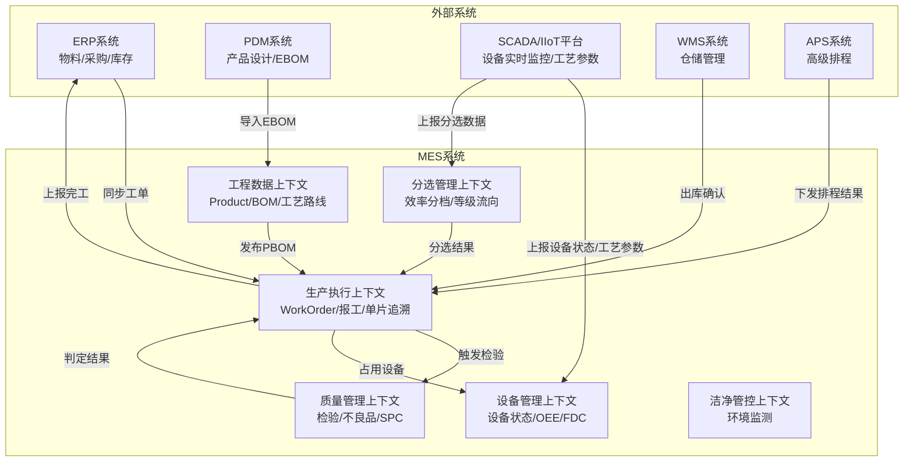
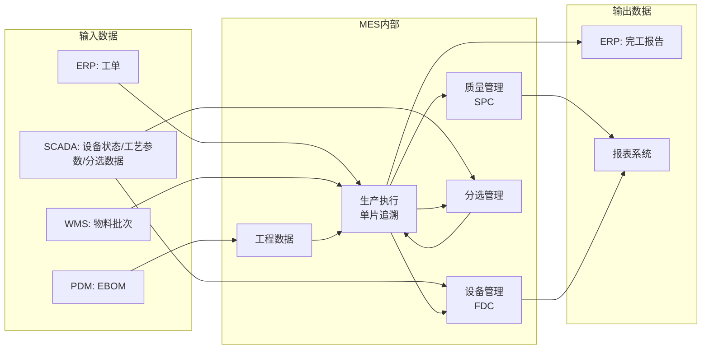

# MES 系统集成与数据流设计文档（光伏产业版）

## 1. 文档概述

### 1.1 目的
本文档记录**光伏 MES 系统**的完整业务流程、数据来源、外部系统集成接口设计，明确 MES 与其他系统（ERP/PDM/SCADA/WMS/APS）的职责边界和数据交互方式。

### 1.2 适用范围
- 光伏 MES 系统内部各模块的数据流
- MES 与外部系统的集成接口
- 数据来源说明（MES 自产 / 外部系统同步）
- **光伏特有流程**：单片追溯、一对多物料转换、分选工序、炉次管理

### 1.3 设计原则
1. **职责清晰**：MES 聚焦工程数据与生产执行，不越界承担其他系统职责
2. **松耦合**：通过防腐层（ACL）隔离外部系统依赖
3. **接口预留**：当前阶段预留接口设计，未来对接时实现
4. **数据溯源**：明确每个数据的来源系统
5. **单片追溯**：每一片硅片、电池片、组件都需要唯一序列号

---

## 2. 光伏生产工序样例

### 2.1 光伏产业链概览

```
石英砂 → 多晶硅 → 硅棒拉制 → 切片 → 电池片 → 组件封装 → 电站应用
         (上游)      (中游)        (下游)
```

### 2.2 典型工序流程（以 PERC 电池片为例）

| 阶段 | 工序编号 | 工序名称 | 输入物料 | 输出物料 | 关键参数 | 特殊说明 |
|------|---------|---------|---------|---------|---------|----------|
| **拉晶** | OP10 | 多晶硅料清洗 | 多晶硅料 | 清洗后硅料 | 温度、时间 | 去除表面杂质 |
|  | OP20 | 装炉 | 清洗后硅料 | - | - | 装入石英坩埚 |
|  | OP30 | 真空加热 | - | - | 温度曲线、真空度 | 熔化硅料 |
|  | OP40 | 晶体生长 | 熔融硅 | 硅棒 | 拉速、温度梯度 | **一对多转换起点** |
|  | OP50 | 冷却出炉 | 硅棒 | 硅棒 | 冷却速率 | - |
| **切片** | OP60 | 硅棒检测 | 硅棒 | 合格硅棒 | 电阻率、少子寿命 | 不合格品降级 |
|  | OP70 | 开方 | 硅棒 | 方棒 | 切割速度 | 切成方形 |
|  | OP80 | 磨面 | 方棒 | 磨后方棒 | 砂轮转速 | 去除损伤层 |
|  | OP90 | 切片 | 方棒 | 硅片 | 线速、砂浆流量 | **1根方棒→1000片硅片** |
|  | OP100 | 清洗 | 硅片 | 清洗后硅片 | 清洗剂浓度 | 去除砂浆残留 |
| **电池片** | OP110 | 制绒 | 硅片 | 绒面硅片 | 温度、时间 | 形成金字塔结构 |
|  | OP120 | 扩散 | 绒面硅片 | 扩散后硅片 | 温度、气体流量 | 形成 PN 结 |
|  | OP130 | 刻蚀 | 扩散后硅片 | 刻蚀后硅片 | 酸液浓度 | 去除边缘 PN 结 |
|  | OP140 | PECVD | 刻蚀后硅片 | 镀膜硅片 | 温度、气体比例 | 沉积减反射膜 |
|  | OP150 | 丝网印刷 | 镀膜硅片 | 印刷后硅片 | 印刷压力、速度 | 印刷电极 |
|  | OP160 | 烧结 | 印刷后硅片 | 电池片 | 温度曲线 | 形成欧姆接触 |
|  | OP170 | 测试分选 | 电池片 | A/B/C级电池片 | 效率、填充因子 | **分选工序** |
| **组件** | OP180 | 串焊 | 电池片 | 电池串 | 焊接温度 | 60片或72片串联 |
|  | OP190 | 叠层 | 电池串+玻璃+EVA | 叠层件 | - | 多层叠加 |
|  | OP200 | 层压 | 叠层件 | 层压件 | 温度、压力、时间 | 真空层压 |
|  | OP210 | 装框 | 层压件 | 装框组件 | - | 安装铝边框 |
|  | OP220 | 接线盒安装 | 装框组件 | 接线后组件 | - | 安装接线盒 |
|  | OP230 | EL测试 | 接线后组件 | 合格组件 | 电流、电压 | 检测隐裂 |
|  | OP240 | 功率测试 | 合格组件 | A/B级组件 | 功率、效率 | **分选工序** |
|  | OP250 | 包装入库 | A/B级组件 | 成品组件 | - | 打包入库 |

### 2.3 光伏 MES 的关键特点

#### 2.3.1 一对多物料转换
```
场景：切片工序
  输入：1根硅棒
  输出：1000片硅片
  
MES 处理：
  - BOM 中定义 YieldRate = 1000
  - 工单执行时记录 InputQuantity = 1, OutputQuantity = 980（有损耗）
  - 为每片硅片生成唯一序列号：WAFER-20260510-000001 ~ 000980
```

#### 2.3.2 单片追溯
```
场景：从组件追溯到硅片
  组件 SN: MODULE-20260510-001
  ↓ 包含 60 片电池片
  电池片 SN: CELL-20260510-000001 ~ 000060
  ↓ 来自哪片硅片
  硅片 SN: WAFER-20260510-000001 ~ 000060
  ↓ 来自哪根硅棒
  硅棒 SN: INGOT-20260510-001
  
MES 实现：
  - WorkReport.SerialNos 字段存储序列号列表（JSON）
  - 通过序列号关联各工序的产出物
```

#### 2.3.3 分选工序
```
场景：电池片测试分选
  工序：OP170 测试分选
  分选类型：Efficiency（效率）
  规则：
    - A级：效率 >= 22.5%
    - B级：效率 >= 21.0% 且 < 22.5%
    - C级：效率 < 21.0%
  
MES 处理：
  - ProcessStep.IsSortingStep = true
  - ProcessStep.SortingType = Efficiency
  - ProcessStep.ThresholdA = 22.5, ThresholdB = 21.0
  - 不同等级流向不同工序（A级→OP180，B级→降级处理，C级→报废）
```

#### 2.3.4 炉次/舟次管理
```
场景：扩散工序
  一炉处理：1000片硅片
  炉次号：DIFFUSION-20260510-001
  
MES 处理：
  - WorkReport.BatchNo = "DIFFUSION-20260510-001"
  - WorkReport.SerialNos = ["CELL-001", "CELL-002", ..., "CELL-1000"]
  - WorkReport.Parameters = {"TEMP_ZONE1": 850.5, "GAS_FLOW": 100.3}
  - 同一炉次的硅片共享相同的工艺参数
```

#### 2.3.5 严格工艺参数管控
```
场景：PECVD 工序
  关键参数：
    - 温度：450±5°C
    - 气体流量：SiH4 100±5 sccm, NH3 200±10 sccm
    - 压力：1.0±0.1 Torr
  
MES 处理：
  - ProcessParameter.UCL = 455, LCL = 445（控制限）
  - ProcessParameter.USL = 460, LSL = 440（规格限）
  - SCADA 每秒采集，MES 每 10 秒保存一次
  - 超差立即报警，记录到 QualityInspection
```

---

## 3. 系统架构全景图



---

## 4. 核心业务流程与数据来源

### 4.1 工程数据管理流程

#### 4.1.1 BOM 管理

| 步骤 | 业务活动 | 数据来源 | 目标系统 | 说明 |
|------|---------|---------|---------|------|
| 1 | 产品设计完成 | PDM 系统 | - | PDM 中完成产品结构设计 |
| 2 | 导入 EBOM | **PDM → MES** | MES 工程数据上下文 | 通过 `IPdmIntegrationService.ImportEbomFromPdm()` |
| 3 | EBOM 转 MBOM | MES 内部 | MES 工程数据上下文 | `BomConversionService.ConvertEbomToMbom()` |
| 4 | MBOM 转 PBOM | MES 内部 | MES 工程数据上下文 | `BomConversionService.ConvertMbomToPbom()`，关联工艺路线 |
| 5 | 工程变更（ECN） | MES 内部 | MES 工程数据上下文 | 创建新版本，保留历史版本 |
| 6 | 发布 PBOM | MES 内部 | MES 生产执行上下文 | 发布后可用于创建工单 |

**光伏特有：一对多 BOM 设计**
```csharp
// 硅片的 BOM（1根硅棒产1000片硅片）
BomItem:
  ComponentProductId: P001 (硅棒)
  Quantity: 0.001  // 生产 1 片硅片需要 0.001 根硅棒
  YieldRate: 1000  // 产出率：1根硅棒产1000片硅片
```

**接口设计：**
```csharp
// 预留接口：从 PDM 导入 EBOM
public interface IPdmIntegrationService
{
    /// <summary>
    /// 从 PDM 导入 EBOM
    /// </summary>
    /// <param name="productCode">产品编码</param>
    /// <returns>导入的产品及 BOM 结构</returns>
    Task<ProductImportResult> ImportEbomFromPdmAsync(string productCode);
    
    /// <summary>
    /// 同步工艺文档
    /// </summary>
    Task SyncProcessDocumentsAsync(Guid productId);
}

// 实现示例（未来对接 PDM 时实现）
public class PdmIntegrationService : IPdmIntegrationService, ITransientDependency
{
    private readonly HttpClient _httpClient;
    
    public async Task<ProductImportResult> ImportEbomFromPdmAsync(string productCode)
    {
        // 调用 PDM API
        var response = await _httpClient.GetAsync($"/api/pdm/products/{productCode}/ebom");
        var pdmData = await response.Content.ReadFromJsonAsync<PdmEbomDto>();
        
        // 转换为 MES 领域对象
        var product = ConvertToProduct(pdmData);
        return new ProductImportResult(product);
    }
}
```

#### 4.1.2 工艺路线管理

| 步骤 | 业务活动 | 数据来源 | 目标系统 | 说明 |
|------|---------|---------|---------|------|
| 1 | 工艺设计 | MES 内部 | MES 工程数据上下文 | 工程师在 MES 中设计工艺路线 |
| 2 | 关联 BOM 版本 | MES 内部 | MES 工程数据上下文 | 工艺路线绑定 PBOM 版本 |
| 3 | 定义工序参数 | MES 内部 | MES 工程数据上下文 | 设置标准工时、关键参数等 |
| 4 | 配置分选工序（光伏特有） | MES 内部 | MES 工程数据上下文 | 设置分选类型、阈值、等级流向 |
| 5 | 发布工艺路线 | MES 内部 | MES 工程数据上下文 | 发布后不可修改，需创建新版本 |
| 6 | 同步到质量系统 | MES 内部 | MES 质量管理上下文 | 根据工艺路线自动生成检验项目 |

**光伏特有：分选工序配置**
```csharp
ProcessStep (OP170 测试分选):
  IsSortingStep: true
  SortingType: Efficiency  // 效率分选
  ThresholdA: 22.5m        // A级阈值
  ThresholdB: 21.0m        // B级阈值
  NextStepForGradeA: OP180_Id  // A级流向串焊
  NextStepForGradeB: OP999_Id  // B级流向降级处理
```

**数据来源：** 100% MES 内部产生

---

### 4.2 生产执行流程

#### 4.2.1 工单创建与下发

| 步骤 | 业务活动 | 数据来源 | 目标系统 | 说明 |
|------|---------|---------|---------|------|
| 1 | 接收生产计划 | **ERP → MES** | MES 生产执行上下文 | 通过 `IErpIntegrationService.ImportWorkOrderFromErp()` |
| 2 | 校验资源可用性 | MES 内部 | MES 工程数据上下文 | 检查产品版本、工艺路线是否有效 |
| 3 | 创建工单 | MES 内部 | MES 生产执行上下文 | 生成 WorkOrder，状态=Created |
| 4 | 工单排程 | **APS → MES**（可选） | MES 生产执行上下文 | APS 计算最优排程，MES 记录计划时间 |
| 5 | 下发工单 | MES 内部 | MES 生产执行上下文 | 状态变更为 Released，触发领域事件 |
| 6 | 预留物料 | **MES → WMS** | WMS 系统 | 通知 WMS 预留所需物料批次 |
| 7 | 通知车间 | MES 内部 | - | 发送通知给车间主任 |

**接口设计：**
```csharp
// 预留接口：从 ERP 导入工单
public interface IErpIntegrationService
{
    /// <summary>
    /// 从 ERP 导入生产工单
    /// </summary>
    Task<WorkOrder> ImportWorkOrderFromErpAsync(ErpWorkOrderDto erpOrder);
    
    /// <summary>
    /// 上报工单完工信息到 ERP
    /// </summary>
    Task ReportWorkOrderCompletionAsync(WorkOrderCompletionReport report);
}

// 预留接口：与 WMS 交互
public interface IWmsIntegrationService
{
    /// <summary>
    /// 请求物料预留
    /// </summary>
    Task<bool> ReserveMaterialsAsync(Guid workOrderId, List<MaterialRequirement> requirements);
    
    /// <summary>
    /// 确认物料出库
    /// </summary>
    Task ConfirmMaterialIssueAsync(Guid workOrderId, string lotNo, int quantity);
}

// 预留接口：与 APS 交互
public interface IApsIntegrationService
{
    /// <summary>
    /// 请求工单排程
    /// </summary>
    Task<SchedulingResult> RequestSchedulingAsync(Guid workOrderId);
    
    /// <summary>
    /// 接收 APS 排程结果
    /// </summary>
    Task ApplySchedulingResultAsync(SchedulingResult result);
}
```

#### 4.2.2 工序执行与报工

| 步骤 | 业务活动 | 数据来源 | 目标系统 | 说明 |
|------|---------|---------|---------|------|
| 1 | 开始工序 | MES 内部 | MES 生产执行上下文 | 操作员扫描工单，状态变更为 InProgress |
| 2 | 领料确认 | **WMS → MES** | MES 生产执行上下文 | WMS 出库后通知 MES，记录使用的物料批次（可选） |
| 3 | 工序加工 | MES 内部 | MES 生产执行上下文 | 记录实际开始时间 |
| 4 | 设备数据采集 | **SCADA → MES** | MES 设备管理上下文 | SCADA 实时采集设备参数，异常时通知 MES |
| 5 | 工序完成 | MES 内部 | MES 生产执行上下文 | 操作员报工，记录完成数量 |
| 6 | **生成序列号（光伏特有）** | MES 内部 | MES 生产执行上下文 | 为每个产出物生成唯一序列号（如硅片、电池片） |
| 7 | **记录炉次号（光伏特有）** | MES 内部 | MES 生产执行上下文 | 批量处理工序记录炉次号（如扩散、PECVD） |
| 8 | 自动报工（可选） | **SCADA → MES** | MES 生产执行上下文 | 设备自动上报产量（如计数器） |
| 9 | 触发下道工序 | MES 内部 | MES 生产执行上下文 | 发布 WorkOrderRoutingCompletedEvent |
| 10 | **分选处理（光伏特有）** | MES 内部 | MES 分选管理上下文 | 如果工序是分选工序，根据效率/功率分档 |
| 11 | 创建检验单 | MES 内部 | MES 质量管理上下文 | 如果工序需要检验，自动生成检验单 |

**光伏特有：单片追溯实现**
```csharp
// 切片工序报工
WorkReport:
  WorkOrderRoutingId: xxx
  ReportType: Output
  Quantity: 980  // 产出980片硅片
  SerialNos: ["WAFER-20260510-000001", "WAFER-20260510-000002", ...]  // 980个序列号
  BatchNo: null  // 切片不是批量处理

// 扩散工序报工（批量处理）
WorkReport:
  WorkOrderRoutingId: xxx
  ReportType: Output
  Quantity: 1000  // 产出1000片电池片
  SerialNos: ["CELL-20260510-000001", ..., "CELL-20260510-0001000"]
  BatchNo: "DIFFUSION-20260510-001"  // 炉次号
  Parameters: {"TEMP_ZONE1": 850.5, "GAS_FLOW": 100.3}  // 工艺参数
```

**接口设计：**
```csharp
// 预留接口：接收 SCADA 设备数据
public interface IScadaIntegrationService
{
    /// <summary>
    /// 接收设备状态上报
    /// </summary>
    Task ReportEquipmentStatusAsync(EquipmentStatusReport report);
    
    /// <summary>
    /// 接收设备实时参数
    /// </summary>
    Task ReportEquipmentParametersAsync(EquipmentParameterReport report);
}

// 实现示例：SCADA 回调接口（MES 提供 API 供 SCADA 调用）
[ApiController]
[Route("api/scada")]
public class ScadaCallbackController : AbpController
{
    private readonly IScadaIntegrationService _scadaService;
    
    [HttpPost("equipment/status")]
    public async Task<IActionResult> ReportEquipmentStatus([FromBody] EquipmentStatusReport report)
    {
        await _scadaService.ReportEquipmentStatusAsync(report);
        return Ok();
    }
}
```

---

### 4.3 质量管理流程

#### 4.3.1 检验执行

| 步骤 | 业务活动 | 数据来源 | 目标系统 | 说明 |
|------|---------|---------|---------|------|
| 1 | 创建检验单 | MES 内部 | MES 质量管理上下文 | 工序完成后自动创建，或手动创建 |
| 2 | 执行检验 | MES 内部 | MES 质量管理上下文 | 检验员录入实测值 |
| 3 | 判定结果 | MES 内部 | MES 质量管理上下文 | 自动判定 Pass/Fail |
| 4 | 不合格处理 | MES 内部 | MES 质量管理上下文 | 创建不良品记录 |
| 5 | 根本原因分析 | MES 内部 | MES 质量管理上下文 | 记录纠正/预防措施 |
| 6 | **SPC 统计分析（光伏特有）** | MES 内部 | MES 质量管理上下文 | 计算 Cpk、绘制 X-bar/R 控制图 |
| 7 | 同步到 ERP（可选） | **MES → ERP** | ERP 系统 | 重大质量事故通知 ERP |

**光伏特有：SPC 统计过程控制**
```csharp
// PECVD 工序温度参数 SPC 分析
ProcessParameter:
  ParameterCode: TEMP_ZONE1
  UCL: 455.0  // 上控制限
  LCL: 445.0  // 下控制限
  USL: 460.0  // 上规格限（客户要求）
  LSL: 440.0  // 下规格限

// 实时采集的数据点
EquipmentDataLog:
  [450.2, 450.5, 449.8, 451.0, ...]  // 每10秒一个数据点

// SPC 计算
Sp cChart:
  Mean: 450.3
  StdDev: 0.5
  Cpk: 1.67  // 过程能力指数（要求 >= 1.33）
  Status: InControl  // 受控状态
```

**数据来源：** 100% MES 内部产生

---

### 4.4 设备管理流程

#### 4.4.1 设备状态管理

| 步骤 | 业务活动 | 数据来源 | 目标系统 | 说明 |
|------|---------|---------|---------|------|
| 1 | 设备状态变更 | **SCADA → MES** | MES 设备管理上下文 | SCADA 上报设备状态（Running/Idle/Down） |
| 2 | 更新设备状态 | MES 内部 | MES 设备管理上下文 | 更新 Equipment.Status |
| 3 | 触发领域事件 | MES 内部 | MES 内部 | 如果状态=Down，发布 EquipmentBreakdownEvent |
| 4 | 暂停受影响工单 | MES 内部 | MES 生产执行上下文 | 事件处理器自动暂停使用该设备的工单 |
| 5 | 创建维修工单 | MES 内部 | MES 设备管理上下文 | 可选，记录维保任务 |
| 6 | OEE 计算 | MES 内部 | MES 设备管理上下文 | 基于班次/天统计，非实时计算 |
| 7 | **FDC 故障检测（光伏特有）** | **SCADA → MES** | MES 设备管理上下文 | 基于工艺参数异常提前预警设备故障 |

**光伏特有：FDC 故障检测与分类**
```
场景：PECVD 设备故障预警
  正常情况：
    - 温度：450±5°C
    - 气体流量：SiH4 100±5 sccm
  
  异常情况（FDC 检测到）：
    - 温度波动增大：StdDev 从 0.5 增加到 2.0
    - 气体流量漂移：平均值从 100 降到 95
  
  MES 处理：
    - 触发预警：Equipment.Warning("PECVD-001: 温度波动异常")
    - 记录到 QualityInspection
    - 通知维护人员检查设备
```

**接口设计：**
```csharp
// 设备状态上报 DTO
public class EquipmentStatusReport
{
    public Guid EquipmentId { get; set; }
    public string EquipmentCode { get; set; }
    public EquipmentStatus Status { get; set; } // Running/Idle/Down/Maintenance
    public DateTime ReportedAt { get; set; }
    public string Reason { get; set; } // 状态变更原因（故障时填写）
    public Dictionary<string, object> Parameters { get; set; } // 附加参数
}

// SCADA 集成服务实现
public class ScadaIntegrationService : IScadaIntegrationService, ITransientDependency
{
    private readonly IEquipmentRepository _equipmentRepository;
    private readonly IWorkOrderRepository _workOrderRepository;
    private readonly IDomainEventBus _eventBus;
    
    public async Task ReportEquipmentStatusAsync(EquipmentStatusReport report)
    {
        var equipment = await _equipmentRepository.GetAsync(report.EquipmentId);
        
        var oldStatus = equipment.Status;
        equipment.UpdateStatus(report.Status);
        
        // 如果设备故障，触发领域事件
        if (report.Status == EquipmentStatus.Down && oldStatus != EquipmentStatus.Down)
        {
            equipment.Breakdown(report.Reason);
            // 领域事件会自动触发工单暂停等后续操作
        }
        
        await _equipmentRepository.UpdateAsync(equipment);
    }
}
```

#### 3.4.2 维保管理

| 步骤 | 业务活动 | 数据来源 | 目标系统 | 说明 |
|------|---------|---------|---------|------|
| 1 | 制定维保计划 | MES 内部 | MES 设备管理上下文 | 预防性维保计划 |
| 2 | 执行维保 | MES 内部 | MES 设备管理上下文 | 记录维保内容、时长、费用 |
| 3 | 维保完成 | MES 内部 | MES 设备管理上下文 | 设备状态恢复为 Idle |
| 4 | 预测性维保（未来） | **IIoT → MES** | MES 设备管理上下文 | IIoT 平台分析设备健康度，提前预警 |

**数据来源：** 当前阶段 100% MES 内部产生，未来可接入 IIoT 预测数据

---

### 4.5 洁净车间管控流程

| 步骤 | 业务活动 | 数据来源 | 目标系统 | 说明 |
|------|---------|---------|---------|------|
| 1 | 环境数据采集 | **环境监测系统 → MES** | MES 洁净管控上下文 | 温湿度、压差、洁净度传感器数据 |
| 2 | 环境异常报警 | MES 内部 | MES 洁净管控上下文 | 超出阈值时设置 Status=Alert |
| 3 | 人员准入授权 | MES 内部 | MES 洁净管控上下文 | 校验人员资质后授权进入 |
| 4 | 物料清洁确认 | MES 内部 | MES 洁净管控上下文 | 确认物料经过清洁处理 |
| 5 | 超员报警 | MES 内部 | MES 洁净管控上下文 | 当前人数 > 最大容量时报警 |

**接口设计：**
```csharp
// 预留接口：接收环境监测数据
public interface IEnvironmentMonitorIntegrationService
{
    Task ReportEnvironmentDataAsync(EnvironmentDataReport report);
}

public class EnvironmentDataReport
{
    public Guid CleanRoomId { get; set; }
    public DateTime MonitorTime { get; set; }
    public decimal Temperature { get; set; }
    public decimal Humidity { get; set; }
    public decimal PressureDiff { get; set; }
    public decimal Cleanliness { get; set; }
}
```

**数据来源：** 环境监测系统（独立硬件系统）→ MES

---

## 5. 外部系统集成接口总览

### 5.1 集成接口清单

| 接口名称 | 方向 | 协议 | 频率 | 说明 | 当前状态 |
|---------|------|------|------|------|---------|
| **ImportEbomFromPdm** | PDM → MES | REST API | 按需 | 导入 EBOM | 📋 已预留 |
| **ImportWorkOrderFromErp** | ERP → MES | REST API / MQ | 按需 | 导入生产工单 | 📋 已预留 |
| **ReportWorkOrderCompletion** | MES → ERP | REST API | 实时 | 上报工单完工 | 📋 已预留 |
| **ReserveMaterials** | MES → WMS | REST API | 实时 | 请求物料预留 | 📋 已预留 |
| **ConfirmMaterialIssue** | WMS → MES | REST API / MQ | 实时 | 确认物料出库 | 📋 已预留 |
| **RequestScheduling** | MES → APS | REST API | 按需 | 请求工单排程 | 📋 已预留 |
| **ApplySchedulingResult** | APS → MES | REST API / MQ | 实时 | 接收排程结果 | 📋 已预留 |
| **ReportEquipmentStatus** | SCADA → MES | MQTT / REST | 秒级 | 上报设备状态 | 📋 已预留 |
| **ReportEquipmentParameters** | SCADA → MES | MQTT | 毫秒级 | 上报设备参数 | 📋 已预留 |
| **ReportSortingData** | SCADA → MES | MQTT / REST | 实时 | 上报分选数据（效率、功率等） | 📋 已预留 |
| **ReportEnvironmentData** | 环监系统 → MES | MQTT / REST | 分钟级 | 上报环境数据 | 📋 已预留 |

### 5.2 防腐层（ACL）设计

所有外部系统集成通过 **Integration 层** 隔离：

```
AbpDemo.Application/
└── Integration/
    ├── ErpIntegrationService.cs      # ERP 集成
    ├── PdmIntegrationService.cs      # PDM 集成
    ├── WmsIntegrationService.cs      # WMS 集成
    ├── ApsIntegrationService.cs      # APS 集成
    ├── ScadaIntegrationService.cs    # SCADA 集成
    └── Dtos/
        ├── ErpWorkOrderDto.cs
        ├── PdmEbomDto.cs
        ├── EquipmentStatusReport.cs
        └── ...
```

**设计原则：**
1. **外部 DTO 与内部领域对象分离**：通过 Mapper 转换
2. **接口抽象化**：定义 `IXxxIntegrationService` 接口，方便 Mock 测试
3. **失败重试机制**：网络异常时自动重试
4. **日志记录**：所有集成调用记录日志，便于排查问题

---

## 6. 数据来源总结

### 6.1 数据分类

| 数据类型 | 来源系统 | 占比 | 说明 |
|---------|---------|------|------|
| **工程数据** | MES 内部（70%）+ PDM（30%） | - | BOM、工艺路线主要由 MES 维护 |
| **生产数据** | MES 内部（90%）+ ERP（10%） | - | 工单可从 ERP 导入，也可 MES 手动创建 |
| **质量数据** | MES 内部（100%） | - | 检验、不良品、SPC 完全由 MES 管理 |
| **设备数据** | SCADA（80%）+ MES（20%） | - | 实时状态/参数来自 SCADA，业务状态由 MES 管理 |
| **物料数据** | WMS/ERP（100%） | - | MES 不存储物料档案，只引用 Product |
| **环境数据** | 环监系统（100%） | - | 洁净车间环境数据来自专用传感器 |
| **分选数据** | SCADA（60%）+ MES（40%） | - | 测试数据来自 SCADA，分档规则由 MES 配置 |
| **序列号数据** | MES 内部（100%） | - | **光伏特有**：硅片/电池片/组件的唯一序列号由 MES 生成 |
| **炉次数据** | MES 内部（100%） | - | **光伏特有**：炉次号由 MES 生成，关联批量处理工序 |

### 6.2 关键数据流向图



---

## 7. 实施路线图

### Phase 1：核心功能（当前阶段）
- ✅ 工程数据管理（Product/BOM/工艺路线）
- ✅ 生产执行（WorkOrder/报工/单片追溯）
- ✅ 质量管理（检验/不良品/SPC）
- ✅ 设备管理（简化版，无实时数据采集）
- ✅ 分选管理（效率分档/等级流向）
- 📋 集成接口预留设计

### Phase 2：系统集成（未来 3-6 个月）
- 🔲 对接 PDM 系统（导入 EBOM）
- 🔲 对接 ERP 系统（工单同步）
- 🔲 对接 WMS 系统（物料管理）
- 🔲 对接 SCADA 系统（设备实时监控/工艺参数采集）

### Phase 3：高级功能（未来 6-12 个月）
- 🔲 对接 APS 系统（智能排程）
- 🔲 对接 IIoT 平台（预测性维保/FDC）
- 🔲 对接环监系统（洁净车间自动化）
- 🔲 CQRS 读写分离优化
- 🔲 SPC 高级分析（Cpk 趋势、根因分析）

---

## 8. 附录

### 8.1 术语表

| 术语 | 英文 | 说明 |
|------|------|------|
| EBOM | Engineering BOM | 设计 BOM，来自 PDM |
| MBOM | Manufacturing BOM | 制造 BOM，MES 内部转换 |
| PBOM | Production BOM | 生产 BOM，关联工艺路线后可用于工单 |
| SCADA | Supervisory Control And Data Acquisition | 数据采集与监控系统 |
| IIoT | Industrial Internet of Things | 工业物联网平台 |
| APS | Advanced Planning and Scheduling | 高级计划与排程系统 |
| WMS | Warehouse Management System | 仓储管理系统 |
| ACL | Anti-Corruption Layer | 防腐层，隔离外部系统依赖 |
| **SPC** | Statistical Process Control | **统计过程控制（光伏特有）** |
| **FDC** | Fault Detection and Classification | **故障检测与分类（光伏特有）** |
| **Cpk** | Process Capability Index | **过程能力指数（要求 >= 1.33）** |
| **PERC** | Passivated Emitter and Rear Cell | **钝化发射极和背面电池（光伏电池技术）** |
| **PECVD** | Plasma Enhanced Chemical Vapor Deposition | **等离子体增强化学气相沉积** |
| **EL测试** | Electroluminescence Testing | **电致发光测试，检测隐裂** |

### 8.2 参考标准

- **ISA-95**：企业控制系统集成国际标准
- **IATF 16949**：汽车行业质量管理体系
- **ISO 9001**：质量管理体系要求
- **GMP**：药品生产质量管理规范（洁净车间适用）
- **IEC 61215**：**地面用晶体硅光伏组件设计鉴定和定型（光伏行业）**
- **IEC 61730**：**光伏组件安全鉴定（光伏行业）**
- **IEC 62891**：**光伏电池效率测试标准（光伏行业）**

---

**文档版本**：V2.0（光伏产业版）  
**最后更新**：2026-05-10  
**作者**：MES 项目组  
**审核状态**：待审核
