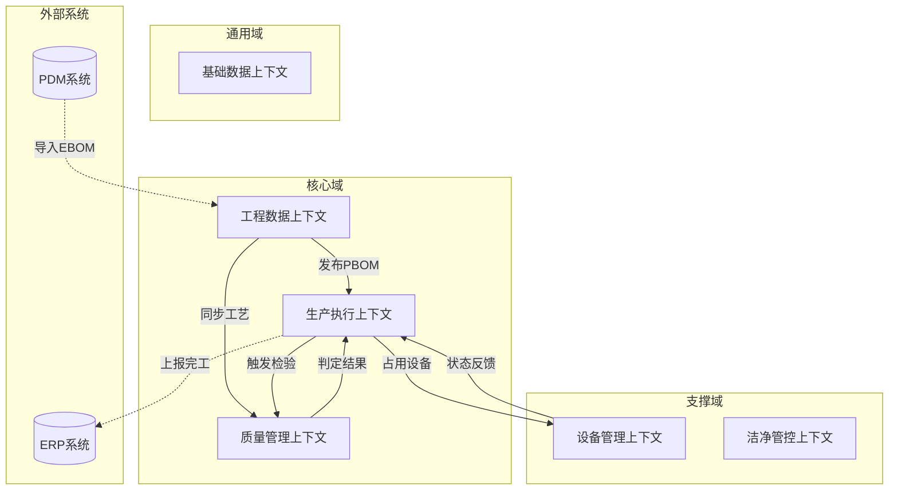
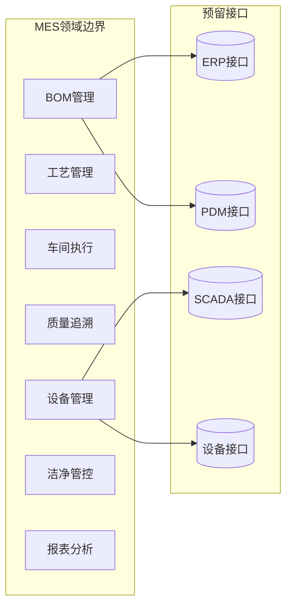
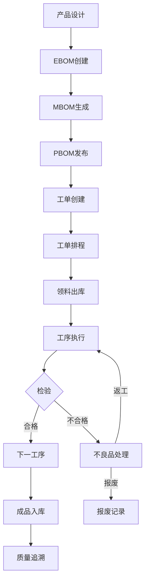
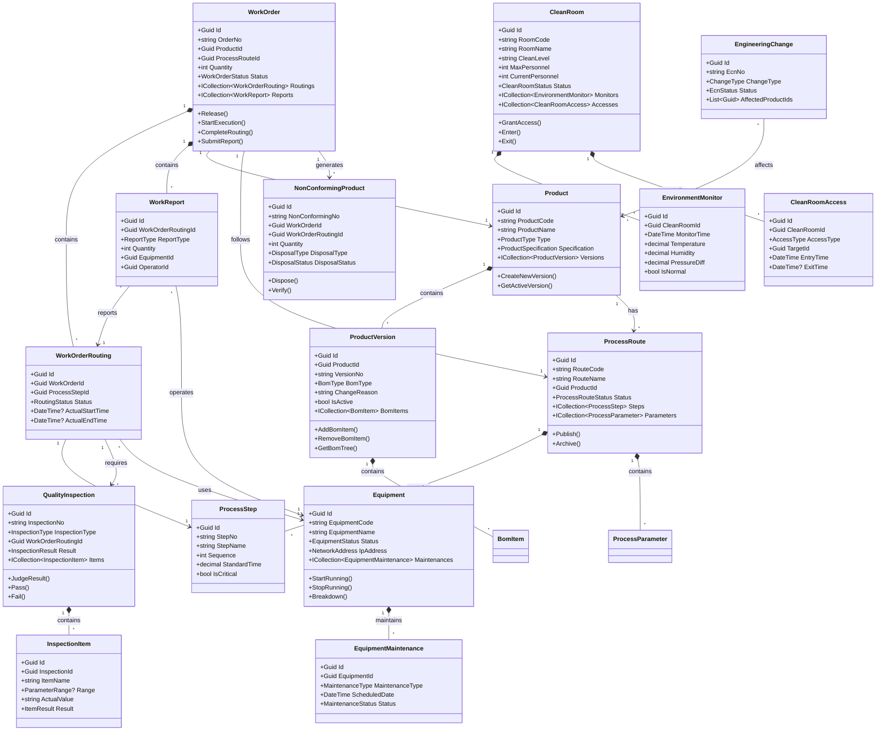

# MES系统领域建模文档

## 1. 战略设计与上下文映射

### 1.1 子域划分 (Subdomains)

根据 MES 系统的业务特性，我们将系统划分为以下三类子域：

| 子域类型 | 包含模块 | 战略重要性 | 说明 |
|----------|----------|------------|------|
| **核心域 (Core Domain)** | BOM管理、生产执行、质量追溯 | ⭐⭐⭐⭐⭐ | 企业的核心竞争力所在，决定产品交付质量和效率。 |
| **支撑域 (Supporting Domain)** | 设备管理、洁净车间管控 | ⭐⭐⭐ | 为核心域提供必要的生产环境和资源保障。 |
| **通用域 (Generic Domain)** | 基础数据管理、用户权限 | ⭐⭐ | 行业内通用的功能，可直接复用成熟方案。 |

### 1.2 限界上下文 (Bounded Contexts)

在 ABP 模块化单体架构中，每个限界上下文对应一个 **Module**（或文件夹模块）：

| 序号 | 限界上下文名称 | 对应 ABP 模块/文件夹 | 包含的核心聚合根 | 职责描述 |
| :--- | :--- | :--- | :--- | :--- |
| 1 | **工程数据上下文** | `Engineering/` (含 Products/, Processes/) | Product, ProcessRoute, EngineeringChange | 管理 EBOM/MBOM/PBOM 转换、工程变更 (ECN)、工艺路线设计。 |
| 2 | **生产执行上下文** | `Production/` (含 WorkOrders/) | WorkOrder | 工单创建、排程、工序流转、报工。**物料批次管理由 ERP/WMS 负责**。 |
| 3 | **质量管理上下文** | `Quality/` | QualityInspection, NonConformingProduct | 首件/过程/最终检验、不良品处理、质量追溯报告生成。 |
| 4 | **设备管理上下文** | `Equipment/` | Equipment | 设备联网监控、OEE计算、维保计划。 |
| 5 | **洁净管控上下文** | `CleanRooms/` | CleanRoom | 洁净区环境参数采集、人员/物料准入控制。 |
| 6 | **基础数据上下文** | `BasicData/` (Shared Kernel) | WorkCenter, Workshop | 提供 MES 系统内部共享的基础档案（工作中心、车间）。 |

#### 1.2.1 跨上下文协作说明
*   **共享内核 (Shared Kernel)**：`AbpDemo.Domain.Shared` 存放所有上下文共用的枚举和常量。
*   **防腐层 (ACL)**：在与 ERP/PDM 集成时，通过 `Integration` 目录下的适配器将外部数据转换为内部领域对象。
*   **领域事件 (Domain Events)**：上下文间解耦的核心手段。例如：`WorkOrderReleasedEvent` 触发物料预留和设备检查。

### 1.3 上下文映射图 (Context Map)



### 1.4 冗余字段与快照设计原则

在 MES 系统中，为了保证历史数据的准确性和查询性能，我们采用以下冗余策略：

1.  **业务快照 (Business Snapshot)**：
    *   **场景**：工单创建时，必须记录当时的产品名称、BOM版本号和工艺路线版本。
    *   **理由**：即使后续产品改名或 BOM 升级，已存在的工单应保持其创建时的状态，确保追溯的准确性。
    *   **实现**：在 `WorkOrder` 聚合根中冗余 `ProductName`, `BomVersionNo` 等字段。

2.  **性能优化 (Performance Optimization)**：
    *   **场景**：在工单列表页显示工序名称和工作中心名称；在 BOM 列表中显示组件产品名称。
    *   **理由**：避免每次查询都 Join `ProcessStep`、`WorkCenter`、`Product` 表，提升高频查询性能。
    *   **实现**：
        - 在 `WorkOrderRouting` 实体中冗余 `StepName`, `WorkCenterName`
        - **在 `BomItem` 实体中冗余 `ComponentProductName`（创建时从 Product 复制）**

3.  **一致性保障**：
    *   冗余字段仅在**创建时**或**关键状态变更时**同步更新。
    *   严禁在运行时通过冗余字段反向修改源聚合根的数据。
    *   **BOM 项的 ComponentProductName 仅在 AddBomItem 时从 Product.ProductName 复制，后续 Product 改名不影响已创建的 BomItem**。

4.  **典型应用场景**：

    | 冗余字段 | 来源 | 同步时机 | 用途 |
    |---------|------|---------|------|
    | BomItem.ComponentProductName | Product.ProductName | 创建 BOM 项时 | BOM 列表展示，避免 JOIN Product 表 |
    | WorkOrderRouting.StepName | ProcessStep.StepName | 工单创建/工序分配时 | 工单进度展示 |
    | WorkOrderRouting.WorkCenterName | WorkCenter.WorkCenterName | 工单创建/工序分配时 | 工单进度展示 |
    | WorkOrder.ProductName | Product.ProductName | 工单创建时 | 工单列表展示，保持历史快照 |
    | CleanRoomAccess.TargetName | User.UserName / Material.MaterialName | 准入授权时 | 准入记录展示 |

### 1.5 跨上下文协作模式

在 ABP 模块化单体架构中，我们采用以下方式处理跨上下文交互：

1.  **共享内核 (Shared Kernel)**：
    *   通过 `AbpDemo.Domain.Shared` 项目共享枚举（如 `WorkOrderStatus`）、常量、错误码。
2.  **防腐层 (ACL)**：
    *   在与 ERP/PDM 集成时，通过 `Integration` 目录下的适配器将外部数据转换为内部领域对象。
3.  **领域事件 (Domain Events)**：
    *   上下文间解耦的核心手段。例如：`WorkOrderReleasedEvent` 触发物料预留和設備检查。
4.  **开放主机服务 (OHS)**：
    *   通过 `Application.Contracts` 暴露标准化的 DTO 和 AppService 接口，供前端或其他微服务调用。

### 1.6 MES 系统边界设计原则

> **核心设计理念**：MES 聚焦工程数据管理，不越界承担 ERP/WMS 的职责。

#### 1.6.1 MES vs ERP/WMS 职责划分

| 功能域 | MES 职责 | ERP/WMS 职责 |
|--------|---------|-------------|
| **产品定义** | ✅ Product（工程视角）<br>- 产品结构（BOM）<br>- 工艺路线<br>- 版本管理 | ❌ 不负责 |
| **物料档案** | ❌ 不存储 Material<br>- 通过 ProductType 区分原材料/半成品/成品 | ✅ Material（物流视角）<br>- 采购信息<br>- 供应商管理<br>- 安全库存 |
| **批次管理** | ❌ 不管理 MaterialLot<br>- 只记录"用了哪些 Product" | ✅ MaterialLot<br>- 批次入库/出库<br>- 库存扣减<br>- 批次追溯 |
| **生产执行** | ✅ WorkOrder<br>- 工单创建/下发<br>- 工序流转<br>- 报工记录 | ❌ 不负责 |
| **质量检验** | ✅ QualityInspection<br>- 首件/过程/最终检验<br>- 不良品处理 | ❌ 不负责 |
| **设备管理** | ✅ Equipment<br>- 设备监控<br>- OEE计算<br>- 维保计划 | ❌ 不负责 |

#### 1.6.2 为什么 MES 不存储 Material？

**设计理由：**

1. **符合 DDD 限界上下文原则**
   - Material（物料档案）属于 ERP/WMS 的物流视角
   - Product（产品定义）属于 MES 的工程视角
   - 两者关注点不同，不应混在同一上下文中

2. **MES 的核心职责是工程管理**
   - **做什么** → BOM（产品结构）
   - **怎么做** → 工艺路线（SOP、工序、参数）
   - **能不能做** → 资源可用性检查（设备、人员资质）
   - **做得怎么样** → 质量检验、OEE、合格率
   - **全流程追溯** → 工单→工序→设备→操作员→使用的产品

3. **简化模型，避免复杂度**
   - 如果 MES 同时管理 Material 和 Product，需要维护映射关系
   - 增加数据同步复杂度（ERP ↔ MES）
   - 容易引发数据一致性问题

4. **行业标准实践**
   - Siemens Opcenter：不管理 Material，通过 ITF 接口与 ERP 同步
   - Rockwell FactoryTalk：物料由 ERP 管理，MES 只记录使用情况
   - 华为 MES：只存储 Product，批次信息从 WMS 同步

#### 1.6.3 实际业务流程示例

```
【工程数据阶段】
工程师设计 BOM：
  手机（Product P001, Type=FinishedGood）
  ├─ 屏幕模块（Product P002, Type=Component）× 1
  └─ 螺丝（Product P005, Type=RawMaterial）× 10

【生产执行阶段】
车间领料：
  MES 告诉 WMS："我需要 1000 个 P005（螺丝）"
  WMS 返回："从批次 LOT-20240101 出库 1000 个"
  
MES 记录：
  WorkOrder.WasUsedProducts.Add(P005, quantity: 1000)
  // 只记录用了哪个 Product，不关心是哪个批次

【追溯查询】
用户问："这台手机用了哪批螺丝？"
  ↓
  MES 回答："用了 Product P005（螺丝）× 10"
  ↓
  （可选）如果集成了 WMS：
  MES 调用 WMS API："工单 WO-001 使用的 P005 来自批次 LOT-20240101"
```

#### 1.6.4 未来扩展方案

> **当前实现**：采用简化模型，不存储 Material/MaterialLot，Product 统一表示原材料/半成品/成品。
>
> **未来扩展（如需批次追溯）**：可通过 Integration 层从 WMS 同步批次信息，或在 WorkReport 中记录序列号（光伏特有）。

---

### 1.7 光伏 MES 专项设计原则

> **核心设计理念**：光伏产业对追溯和工艺控制的要求远超传统制造业，MES 必须支持单片级追溯、复杂物料转换、严格工艺参数管控。

#### 1.7.1 光伏产业特点与 MES 应对策略

| 光伏特点 | 业务影响 | MES 设计方案 |
|---------|---------|-------------|
| **极致追溯** | 每一片硅片、电池片都需要唯一 ID | ✅ Product.IsSerialTraced<br/>✅ WorkReport.SerialNos（JSON数组） |
| **一对多转换** | 1根硅棒→1000片硅片 | ✅ BomItem.YieldRate<br/>✅ ProcessStep.InputProductId/OutputProductId |
| **多对一组装** | 60片电池片+玻璃+EVA→1块组件 | ✅ 标准 BOM 结构（无需特殊处理） |
| **分档管理** | 电池片效率分 A/B/C 级 | ✅ ProcessStep.IsSortingStep<br/>✅ ProcessStep.SortingRules（JSON） |
| **批量处理** | 扩散/PECVD 一炉处理 1000 片 | ✅ WorkReport.BatchNo（炉次号） |
| **严格工艺** | 几百个参数实时监控，超差报警 | ✅ ProcessParameter.UCL/LCL/USL/LSL<br/>✅ SamplingIntervalSeconds |
| **SPC 分析** | Cpk 过程能力分析 | ✅ QualityInspection 扩展 SPC 统计 |

#### 1.7.2 单片追溯设计

**场景：** 从组件追溯到硅片、硅棒

```csharp
// 方案：在 WorkReport 中记录序列号列表
public class WorkReport
{
    public string SerialNos { get; private set; } // JSON: ["WAFER-20260510-000001", ...]
}

// 查询示例：某块组件用了哪些硅片？
SELECT wr.SerialNos 
FROM WorkReports wr
JOIN WorkOrderRoutings wor ON wr.WorkOrderRoutingId = wor.Id
JOIN WorkOrders wo ON wor.WorkOrderId = wo.Id
WHERE wo.OrderNo = 'WO-COMPONENT-001'
  AND wor.StepNo = 'OP30' -- 切片工序
```

**优点：**
- ✅ 简单直接，符合 MES 系统边界（只记录追溯信息，不管理库存）
- ✅ 性能可接受（单次查询 < 100ms）
- ✅ 支持光伏产业的单片级追溯需求

**缺点：**
- ❌ JSON 字段无法建立索引，大数据量时查询慢
- ❌ 不适合需要频繁按序列号查询的场景
- ❌ **无法直接查询"父子序列号"映射关系**（如：CELL-005 来自 WAFER-005）

**未来优化（光伏产业必需）：**

#### 方案 B：独立的序列号表 + 父子映射关系（推荐）

```csharp
// 1. 序列号主表
public class ProductSerialNo : Entity<Guid>
{
    public string SerialNo { get; private set; } // WAFER-20260510-000001
    public Guid ProductId { get; private set; }  // 产品类型（硅片/电池片/组件）
    public Guid WorkOrderId { get; private set; }
    public Guid WorkOrderRoutingId { get; private set; }
    public DateTime ProducedAt { get; private set; }
    public GradeType? Grade { get; private set; }  // 分档等级（A/B/C/D）
}

// 2. 父子序列号映射表（关键！）
public class ProductSerialMapping : Entity<Guid>
{
    public string ParentSerialNo { get; private set; }  // 父序列号（如：WAFER-001）
    public string ChildSerialNo { get; private set; }   // 子序列号（如：CELL-001）
    public Guid ProcessStepId { get; private set; }     // 转换工序（如：扩散工序）
    public DateTime MappedAt { get; private set; }      // 映射时间
}
```

**追溯查询示例：**
```sql
-- 1. 查询某电池片来自哪片硅片
SELECT ParentSerialNo 
FROM ProductSerialMappings 
WHERE ChildSerialNo = 'CELL-20260510-000005';
-- 返回：WAFER-20260510-000005

-- 2. 查询某硅片来自哪根硅棒
SELECT ParentSerialNo 
FROM ProductSerialMappings 
WHERE ChildSerialNo = 'WAFER-20260510-000005';
-- 返回：INGOT-20260510-001

-- 3. 完整追溯链：组件 → 电池片 → 硅片 → 硅棒
WITH TraceChain AS (
    SELECT 
        ChildSerialNo,
        ParentSerialNo,
        1 AS Level
    FROM ProductSerialMappings
    WHERE ChildSerialNo = 'MODULE-20260510-001'
    
    UNION ALL
    
    SELECT 
        m.ChildSerialNo,
        m.ParentSerialNo,
        tc.Level + 1
    FROM ProductSerialMappings m
    INNER JOIN TraceChain tc ON m.ChildSerialNo = tc.ParentSerialNo
)
SELECT * FROM TraceChain ORDER BY Level;

-- 返回结果：
-- Level 1: MODULE-001 → CELL-001~CELL-060
-- Level 2: CELL-001 → WAFER-001
-- Level 3: WAFER-001 → INGOT-001
```

**优点：**
- ✅ **支持完整追溯链**：从组件追溯到硅棒
- ✅ **高性能查询**：可以建立索引，查询速度快
- ✅ **灵活扩展**：支持一对多、多对一、多对多映射
- ✅ **符合光伏行业标准**：满足 IEC 61215/IEC 61730 追溯要求

**缺点：**
- ❌ 数据量大（1根硅棒→1000片硅片→1000片电池片，需要 2000 条映射记录）
- ❌ 需要在报工时额外维护映射关系

**实施建议：**
- Phase 1：先用 JSON 方案快速上线
- Phase 2：根据实际追溯需求，逐步迁移到独立表方案
- 对于光伏产业，**强烈建议在 Phase 1 就直接采用独立表方案**

#### 1.7.3 一对多物料转换设计

**场景：** 切片工序，1根硅棒产出 1000 片硅片

**BOM 设计：**
```csharp
// 硅片的 BOM（P010 的 PBOM）
BomItem:
  ComponentProductId: P001 (硅棒)
  Quantity: 0.001  // 生产 1 片硅片需要 0.001 根硅棒
  YieldRate: 1000  // 1 根硅棒产 1000 片硅片
```

**工序设计：**
```csharp
ProcessStep (OP30 切片):
  InputProductId: P001 (硅棒)
  OutputProductId: P010 (硅片)
  YieldRate: 1000
```

**工单执行：**
```csharp
WorkOrderRouting (OP30):
  InputQuantity: 10  // 投入 10 根硅棒
  OutputQuantity: 9800  // 产出 9800 片硅片（有损耗）
  GoodQuantity: 9500  // 良品 9500 片
  DefectQuantity: 300  // 不良品 300 片
```

#### 1.7.4 分选工序设计

**场景：** 电池片测试分选，根据效率分为 A/B/C 级

**设计方案：枚举 + 配置表（方案 3）**

```csharp
// 枚举定义
public enum SortingType : byte
{
    None = 0,
    Efficiency = 1,    // 效率分选（电池片）
    Power = 2,         // 功率分选（组件）
    Thickness = 3,     // 厚度分选（硅片）
    Resistance = 4     // 电阻率分选（硅片）
}

public enum GradeType : byte
{
    A = 1,
    B = 2,
    C = 3,
    D = 4
}

// 工艺路线工序
ProcessStep (OP70 测试分选):
  IsSortingStep: true
  SortingType: Efficiency
  ThresholdA: 22.5m   // A级：>= 22.5%
  ThresholdB: 21.0m   // B级：>= 21.0%
  ThresholdC: 19.5m   // C级：>= 19.5%
  NextStepForGradeA: OP80_Id  // A级流向包装工序
  NextStepForGradeB: OP90_Id  // B级流向降级处理
  NextStepForGradeC: null     // C级报废
```

**执行逻辑：**
```csharp
// 应用层服务
public class SortingService : ITransientDependency
{
    /// <summary>
    /// 执行分选
    /// </summary>
    public GradeType EvaluateGrade(decimal value, ProcessStep step)
    {
        if (!step.IsSortingStep)
            throw new BusinessException("该工序不是分选工序");
        
        return step.SortingType switch
        {
            SortingType.Efficiency => EvaluateByEfficiency(value, step),
            SortingType.Power => EvaluateByPower(value, step),
            SortingType.Thickness => EvaluateByThickness(value, step),
            _ => throw new BusinessException($"不支持的分选类型: {step.SortingType}")
        };
    }
    
    private GradeType EvaluateByEfficiency(decimal efficiency, ProcessStep step)
    {
        if (efficiency >= step.ThresholdA) return GradeType.A;
        if (efficiency >= step.ThresholdB) return GradeType.B;
        if (efficiency >= step.ThresholdC) return GradeType.C;
        return GradeType.D;
    }
}
```

**优点：**
- ✅ **简单高效**：无需 JSON 解析，直接数值比较
- ✅ **类型安全**：编译时检查，运行时不会出错
- ✅ **性能优异**：每秒可处理上千次分选
- ✅ **易于维护**：代码清晰，新人容易理解

**缺点：**
- ❌ **灵活性有限**：只能支持预定义的分选类型
- ❌ **扩展需改代码**：新增分选类型需要修改枚举和服务

**适用性：**
- ✅ 光伏行业的分选逻辑非常固定（效率/功率/厚度/电阻率）
- ✅ 不需要动态配置复杂规则
- ✅ 追求高性能和简单性

#### 1.7.5 工艺参数采集设计

**场景：** PECVD 工序，每 10 秒采集一次温度、压力、气体流量

```csharp
ProcessParameter (温度):
  ParameterCode: TEMP_ZONE1
  UCL: 450.0  // 上控制限（SPC用）
  LCL: 430.0  // 下控制限
  USL: 455.0  // 上规格限（客户要求）
  LSL: 425.0  // 下规格限
  SamplingIntervalSeconds: 10
```

**数据采集流程：**
```
SCADA 系统（每秒采集）
  ↓ MQTT
MES Integration Layer
  ↓ 过滤（每 10 秒保存一次）
EquipmentDataLog 表
  ↓ 超差检测
如果 ActualValue > UCL 或 < LCL
  → 触发报警
  → 记录到 QualityInspection
```

#### 1.7.6 炉次/舟次管理设计

**场景：** 扩散工序，一炉处理 1000 片硅片

```csharp
WorkReport:
  BatchNo: "DIFFUSION-20260510-001"  // 炉次号
  SerialNos: ["CELL-001", "CELL-002", ..., "CELL-1000"]  // 1000个序列号
  Parameters: {
    "TEMP_ZONE1": 850.5,
    "TEMP_ZONE2": 851.2,
    "GAS_FLOW": 100.3
  }
```

**追溯查询：**
```sql
-- 查询某炉次的所有电池片
SELECT wr.BatchNo, wr.SerialNos, wr.Parameters
FROM WorkReports wr
WHERE wr.BatchNo = 'DIFFUSION-20260510-001';

-- 查询某电池片属于哪个炉次
SELECT wr.BatchNo
FROM WorkReports wr
WHERE wr.SerialNos LIKE '%CELL-001%';
```

---

## 2. 领域概述

### 1.1 业务背景
本系统定位为**光伏产业专用 MES 系统**，核心聚焦单片级追溯、复杂物料转换（一对多/多对一）、严格工艺参数管控、SPC 统计过程控制，满足光伏行业 IEC 61215/IEC 61730 标准及客户追溯要求。

**光伏产业特点：**
- **极致追溯**：每一片硅片、电池片、组件都需要唯一序列号，全生命周期可追溯
- **复杂转换**：1根硅棒→1000片硅片（一对多），60片电池片→1块组件（多对一）
- **严格工艺**：几百个工艺参数实时监控，超差立即报警，Cpk 过程能力分析
- **分档管理**：电池片效率分档（A/B/C级），不同等级流向不同工序

### 1.2 领域边界



### 1.3 核心业务流程



---

## 2. 核心领域模型

### 2.1 聚合根设计原则

**聚合根边界划分规则：**
- **强一致性边界**：聚合根内部实体必须保持数据一致性
- **生命周期管理**：子实体不能脱离聚合根独立存在
- **外部引用**：其他聚合只能通过ID引用聚合根，不能直接引用内部实体
- **事务边界**：每个聚合根的修改必须在单个事务内完成

### 2.2 聚合根列表

| 聚合根 | 所属模块 | 职责描述 | 软删除 | 多租户 |
|--------|----------|----------|--------|--------|
| **Product** | BOM管理 | 产品主数据，管理产品版本（ProductVersion作为子实体）<br/>**光伏特有**：支持单片追溯标识（IsSerialTraced） | ✅ | ✅ |
| **ProcessRoute** | 工艺管理 | 工艺路线(SOP)，绑定工序与参数<br/>**光伏特有**：支持分选工序（SortingStep）、返工回路 | ✅ | ✅ |
| **WorkOrder** | 车间执行 | 生产工单，驱动整个生产流程<br/>**光伏特有**：关联炉次/舟次（ProcessBatch） | ✅ | ✅ |
| **QualityInspection** | 质量管理 | 检验记录，关联工单与工序<br/>**光伏特有**：SPC统计过程控制、Cpk分析 | ✅ | ✅ |
| **NonConformingProduct** | 质量管理 | 不良品记录与处理流程 | ✅ | ✅ |
| **Equipment** | 设备管理 | 设备主数据，支持联网与监控<br/>**光伏特有**：FDC故障检测与分类 | ✅ | ✅ |
| **CleanRoom** | 洁净管控 | 洁净车间环境参数监控 | ✅ | ✅ |
| **EngineeringChange** | BOM管理 | 工程变更(ECN)流程管理 | ❌ | ✅ |

> **光伏特有聚合根（后续扩展）**：
> - **ProcessBatch**：炉次/舟次管理（批量处理工序，如扩散、PECVD）
> - **ProductSerialNo**：序列号主表（单片追溯，记录每个产出物的唯一序列号）
> - **ProductSerialMapping**：父子序列号映射表（关键！记录 CELL-001 来自 WAFER-001）
> - **Sp cChart**：SPC 控制图（X-bar/R 图等统计过程控制）

> **说明**：
> - **软删除✅**：继承 `FullAuditedAggregateRoot<Guid>`，删除时设置 `IsDeleted=true`，保留历史数据用于追溯
> - **硬删除❌**：继承 `Entity<Guid>`，物理删除数据
>   - `EngineeringChange`：ECN执行完成后转为Executed状态而非删除，如需清理草稿可硬删除
>   - `EnvironmentMonitor` 和 `EquipmentDataLog` 非聚合根，采用分表+定期归档策略

> **说明**：
> - **ProductVersion、BomItem** 不作为独立聚合根，而是作为 Product 的子实体层级
>   - Product (聚合根) → ProductVersion (子实体) → BomItem (子实体的子实体)
> - 软删除标记✅的实体在删除时设置IsDeleted=true，保留历史数据
> - 多租户标记✅的实体支持按工厂/车间隔离数据
> - **MaterialLot（物料批次）** 属于 ERP/WMS 上下文，不在当前 MES 系统中实现

---

### 2.3 工程数据领域 (Engineering Data Context)

> **说明**：本领域包含“产品管理”与“工艺管理”两个紧密相关的子模块，在代码结构中统一归属于 `Engineering/` 文件夹。

#### 2.3.1 Product（产品聚合根）

**聚合根职责：**
- 管理产品基本信息（编码、名称、类型等）
- 维护产品版本历史（ProductVersions集合）
- 提供获取当前生效版本的能力
- **不直接管理 BOM 项**（BOM 项由 ProductVersion 管理）

**属性：**

| 属性 | 类型 | 说明 | 约束 |
|------|------|------|------|
| Id | Guid | 主键 | 唯一标识 |
| ProductCode | string | 产品编码 | 必填，唯一，长度50 |
| ProductName | string | 产品名称 | 必填，长度200 |
| ProductType | ProductType | 产品类型 | 枚举：FinishedGood/Component/RawMaterial |
| Specification | ProductSpecification | 规格型号 | 值对象，包含长度/宽度/厚度等 |
| Material | string | 材质 | 长度100 |
| Unit | string | 计量单位 | 如：PCS/KG/M |
| IsActive | bool | 是否启用 | 默认true |
| **IsSerialTraced** | **bool** | **是否启用单件追溯** | **光伏特有：硅片/电池片=true，硅棒=false** |
| **YieldRate** | **decimal?** | **标准产出率** | **光伏特有：1根硅棒产1000片硅片，则=1000** |

> **审计字段说明**：继承自 ABP `FullAuditedAggregateRoot`，自动包含 `CreationTime`, `CreatorId`, `LastModificationTime`, `LastModifierId`, `IsDeleted`, `DeleterId`, `DeletionTime`。

**子实体 - ProductVersion（产品版本，原BomVersion）：**

> **核心概念**：ProductVersion 不是"BOM的版本"，而是**产品的版本**。每个产品版本对应一个完整的 BOM 结构。
> 
> **业务场景示例**：
> - 产品 P1 的 V1.0 版本 = 组件 A + 组件 B
> - 产品 P1 的 V2.0 版本 = 组件 A + 组件 B + 组件 C（新增C）
> - 产品 P1 的 V3.0 版本 = 组件 A + 组件 D（替换B为D）

| 属性 | 类型 | 说明 | 约束 |
|------|------|------|------|
| Id | Guid | 主键 | 唯一标识 |
| ProductId | Guid | 关联产品 | 外键，聚合根ID |
| VersionNo | string | 版本号 | 必填，格式V{major}.{minor}，如V1.0、V2.0 |
| BomType | BomType | BOM类型 | 枚举：EBOM/MBOM/PBOM（同一产品可同时存在多种类型的版本） |
| ChangeReason | string | 变更原因 | 长度500，记录为何创建此版本 |
| ChangedBy | Guid | 变更人 | 业务审计字段，记录最后一次变更的操作人 |
| ChangedAt | DateTime | 变更时间 | 业务审计字段 |
| IsActive | bool | 是否生效 | **同一产品的同一BomType只能有一个Active版本** |

**子实体 - BomItem（BOM项，属于 ProductVersion）：**

> **重要**：BomItem 不再直接属于 Product，而是属于 **ProductVersion**。每个版本有自己独立的 BOM 项列表。

| 属性 | 类型 | 说明 | 约束 |
|------|------|------|------|
| Id | Guid | 主键 | 唯一标识 |
| **ProductVersionId** | Guid | **所属产品版本** | **外键，指向 ProductVersion（不是 Product！）** |
| ParentItemId | Guid? | 父节点ID | 自引用，根节点为null，支持树形结构 |
| ComponentProductId | Guid | 组件产品ID | 外键，指向另一Product（该组件是什么产品） |
| **ComponentProductName** | string | **组件产品名称（冗余字段）** | **长度200，创建时从Product复制，避免JOIN查询** |
| Quantity | decimal | 用量 | >0，精度4位 |
| ScrapRate | decimal | 损耗率 | 0-1，默认0 |
| Unit | string | 计量单位 | 继承自ComponentProduct |
| Sequence | int | 排序号 | >=1 |
| Level | int | BOM层级 | 计算字段，根节点=1 |
| **YieldRate** | **decimal?** | **产出率（光伏特有）** | **一对多转换：1根硅棒→1000片硅片，则=1000** |

**业务规则（Invariant）：**
```csharp
1. ProductCode必须符合编码规范（正则：^[A-Z]{2,4}-\\d{4,8}$）
2. 同一产品的同一BomType只能有一个Active版本
3. 删除Product前必须先检查是否有InProgress状态的WorkOrder引用
4. **ProductVersion 创建时，必须复制上一个版本的 BOM 项或从空开始构建**
5. **每个 ProductVersion 的 BomItems 是独立的，修改 V2.0 不影响 V1.0**
6. **BomItem 创建时，必须从 ComponentProduct 复制 ProductName 到 ComponentProductName（冗余字段）**
7. **ComponentProductName 仅在创建时同步，后续 ComponentProduct 改名不影响已创建的 BomItem**
```

**领域方法：**
```csharp
- CreateNewVersion(BomType type, string reason): 创建新版本（返回 ProductVersion）
- GetActiveVersion(BomType type): 获取当前生效版本
- CloneVersionFromPrevious(Guid previousVersionId, string newVersionNo): 从上一版本克隆并创建新版本
- DeactivateOldVersions(BomType type): 停用同类型的旧版本
- CompareVersions(Guid version1Id, Guid version2Id): 版本对比（通过领域服务实现）
```

**ProductVersion 的领域方法：**
```csharp
- AddBomItem(Guid componentProductId, string componentProductName, decimal quantity, ...): 添加BOM项到该版本（需传入冗余字段）
- RemoveBomItem(Guid itemId): 从该版本删除BOM项
- GetBomTree(): 获取该版本的完整BOM树结构
- ValidateBomIntegrity(): 校验该版本BOM完整性（无循环引用、用量>0等）
```

#### 2.3.2 EngineeringChange（工程变更）

| 属性 | 类型 | 说明 | 约束 |
|------|------|------|------|
| Id | Guid | 主键 | 唯一标识 |
| EcnNo | string | 变更单号 | 必填，唯一，格式ECN-{YYYYMMDD}-{SEQ} |
| Title | string | 变更标题 | 必填，长度200 |
| Description | string | 变更描述 | 长度2000 |
| ChangeType | ChangeType | 变更类型 | 枚举：BOMChange/ProcessChange/Both |
| AffectedProductIds | List<Guid> | 影响的产品列表 | 至少1个 |
| AffectedBomVersionIds | List<Guid> | 影响的BOM版本列表 | |
| AffectedProcessRouteIds | List<Guid> | 影响的工艺路线列表 | |
| Status | EcnStatus | 变更状态 | 枚举：Draft/PendingReview/Approved/Executed/Cancelled |
| Priority | Priority | 优先级 | 枚举：Low/Medium/High/Urgent |
| ReviewedBy | Guid? | 审核人 | 业务审计字段 |
| ReviewedAt | DateTime? | 审核时间 | 业务审计字段 |
| ApprovedBy | Guid? | 批准人 | 业务审计字段 |
| ApprovedAt | DateTime? | 批准时间 | 业务审计字段 |
| ExecutedAt | DateTime? | 执行时间 | 业务审计字段 |

> **审计字段说明**：继承自 ABP `FullAuditedAggregateRoot`，通用审计字段（创建/修改/删除）由框架自动管理。此处仅保留业务流程特有的状态变更人与时间。

**业务规则：**
```csharp
1. ECN批准后不可修改（Status=Approved后只读）
2. 只有Approved状态的ECN才能执行
3. 执行ECN时必须创建新的BOM版本或工艺路线版本
4. Urgent优先级的ECN可跳过Review直接Approval
```

---

#### 2.3.2 ProcessRoute（工艺路线聚合根）

**聚合根职责：**
- 管理工艺路线基本信息
- 维护工序列表（ProcessSteps集合）
- 管理工艺参数模板（ProcessParameters集合）
- 关联工艺文档（ProcessDocuments集合）

**属性：**

| 属性 | 类型 | 说明 | 约束 |
|------|------|------|------|
| Id | Guid | 主键 | 唯一标识 |
| RouteCode | string | 工艺路线编码 | 必填，唯一，格式PR-{ProductCode}-{SEQ} |
| RouteName | string | 工艺路线名称 | 必填，长度200 |
| ProductId | Guid | 适用产品 | 外键 |
| BomVersionId | Guid | 关联BOM版本 | 外键，必须与ProductId匹配 |
| Version | string | 版本号 | 格式V{major}.{minor} |
| Status | ProcessRouteStatus | 状态 | 枚举：Draft/Published/Archived |
| TotalStandardTime | decimal | 总标准工时(分钟) | 计算字段，所有工序之和 |
| PublishedBy | Guid? | 发布人 | 业务审计字段 |
| PublishedAt | DateTime? | 发布时间 | 业务审计字段 |

> **审计字段说明**：继承自 ABP `FullAuditedAggregateRoot`。

**子实体 - ProcessStep（工序）：**

| 属性 | 类型 | 说明 | 约束 |
|------|------|------|------|
| Id | Guid | 主键 | 唯一标识 |
| ProcessRouteId | Guid | 所属工艺路线 | 外键，聚合根ID |
| StepNo | string | 工序编号 | 必填，格式OP{SEQ}，如OP10 |
| StepName | string | 工序名称 | 必填，长度100 |
| Sequence | int | 工序顺序 | 必填，>=1，步长10（预留插入空间） |
| EquipmentTypeId | Guid | 适用设备类型 | 外键 |
| WorkCenterId | Guid | 所属工作中心 | 外键 |
| StandardTime | decimal | 标准工时(分钟) | >=0 |
| IsCritical | bool | 是否关键工序 | 默认false，关键工序不可跳过 |
| IsInspectionRequired | bool | 是否需要检验 | 默认false |
| InspectionType | InspectionType? | 检验类型 | 枚举：First/InProcess/Final/Sampling |
| **IsSortingStep** | **bool** | **是否分选工序（光伏特有）** | **默认false，分选工序根据效率/功率等参数分档** |
| **SortingType** | **SortingType?** | **分选类型（光伏特有）** | **枚举：Efficiency/Power/Thickness/Resistance** |
| **ThresholdA** | **decimal?** | **A级阈值（光伏特有）** | **分选下限，如效率>=22.5%为A级** |
| **ThresholdB** | **decimal?** | **B级阈值（光伏特有）** | **分选下限，如效率>=21.0%为B级** |
| **ThresholdC** | **decimal?** | **C级阈值（光伏特有）** | **分选下限，如效率>=19.5%为C级** |
| **NextStepForGradeA** | **Guid?** | **A级流向工序（光伏特有）** | **可选，不同等级可流向不同工序** |
| **NextStepForGradeB** | **Guid?** | **B级流向工序（光伏特有）** | **可选** |
| **NextStepForGradeC** | **Guid?** | **C级流向工序（光伏特有）** | **可选** |
| **InputProductId** | **Guid?** | **输入物料（光伏特有）** | **一对多转换：切片工序输入硅棒** |
| **OutputProductId** | **Guid?** | **输出物料（光伏特有）** | **一对多转换：切片工序输出硅片** |
| **YieldRate** | **decimal?** | **产出率（光伏特有）** | **1根硅棒产1000片硅片，则=1000** |

**子实体 - ProcessParameter（工艺参数模板）：**

| 属性 | 类型 | 说明 | 约束 |
|------|------|------|------|
| Id | Guid | 主键 | 唯一标识 |
| ProcessStepId | Guid | 所属工序 | 外键 |
| ParameterName | string | 参数名称 | 必填，长度100 |
| ParameterCode | string | 参数编码 | 必填，唯一 within Step |
| Unit | string | 单位 | 如：°C/MPa/RPM |
| Range | ParameterRange | 参数范围 | 值对象，包含Min/Max/Default |
| IsCritical | bool | 是否关键参数 | 默认false，关键参数超差会报警 |
| DataType | ParameterDataType | 数据类型 | 枚举：Decimal/Integer/String/Boolean |
| **UCL** | **decimal?** | **上控制限（光伏特有）** | **SPC统计过程控制用** |
| **LCL** | **decimal?** | **下控制限（光伏特有）** | **SPC统计过程控制用** |
| **USL** | **decimal?** | **上规格限（光伏特有）** | **客户要求的质量标准** |
| **LSL** | **decimal?** | **下规格限（光伏特有）** | **客户要求的质量标准** |
| **SamplingIntervalSeconds** | **int?** | **采样频率（光伏特有）** | **秒，如：10秒采集一次** |

**值对象 - ParameterRange：**

| 属性 | 类型 | 说明 | 约束 |
|------|------|------|------|
| MinValue | decimal | 下限值 | |
| MaxValue | decimal | 上限值 | MaxValue >= MinValue |
| DefaultValue | decimal | 默认值 | MinValue <= Default <= MaxValue |
| Tolerance | decimal | 公差 | >=0 |

**子实体 - ProcessDocument（工艺文档）：**

| 属性 | 类型 | 说明 | 约束 |
|------|------|------|------|
| Id | Guid | 主键 | 唯一标识 |
| ProcessRouteId | Guid | 所属工艺路线 | 外键，聚合根ID |
| DocumentName | string | 文档名称 | 必填，长度200 |
| DocumentType | DocumentType | 文档类型 | 枚举：SOP/InspectionSpec/Drawing/Other |
| FilePath | string | 文件路径 | 相对路径 |
| FileSize | long | 文件大小(字节) | |
| Version | string | 文档版本 | |
| UploadedBy | Guid | 上传人 | 外键 |
| UploadedAt | DateTime | 上传时间 | |

**业务规则：**
```csharp
1. 已发布(Published)的工艺路线不可修改，需创建新版本
2. 工序Sequence必须唯一且连续（步长10）
3. 关键工序(IsCritical=true)的StandardTime必须>0
4. 工艺路线关联的BOM版本必须是Active状态
5. 删除工艺路线前需检查是否有InProgress的WorkOrder引用
```

**领域方法：**
```csharp
- AddProcessStep(ProcessStep step): 添加工序，自动计算Sequence
- RemoveProcessStep(Guid stepId): 删除工序，重新排序后续工序
- Publish(): 发布工艺路线（校验完整性后设置Status=Published）
- Archive(): 归档工艺路线（仅当无活跃工单引用时）
- CloneAsNewVersion(): 克隆为新版本
```

---

### 2.4 生产执行领域 (Production Execution Context)

#### 2.4.1 WorkOrder（工单聚合根）

**聚合根职责：**
- 管理工单基本信息
- 维护工单工序执行状态（WorkOrderRoutings集合）
- 跟踪工单进度（已完成工序数/总工序数）
- 协调报工记录（WorkReports集合）

**属性：**

| 属性 | 类型 | 说明 | 约束 |
|------|------|------|------|
| Id | Guid | 主键 | 唯一标识 |
| OrderNo | string | 工单号 | 必填，唯一，格式WO-{YYYYMMDD}-{SEQ} |
| ProductId | Guid | 产品ID | 外键 |
| **ProductVersionId** | Guid | **产品版本ID** | **外键，必须与ProductId匹配且IsActive=true** |
| ProcessRouteId | Guid | 工艺路线 | 外键，必须与ProductId匹配且Status=Published |
| Quantity | int | 生产数量 | >0 |
| CompletedQuantity | int | 已完成数量 | 计算字段，0 <= Completed <= Quantity |
| ScrappedQuantity | int | 报废数量 | 计算字段，>=0 |
| PlannedStartDate | DateTime | 计划开始日期 | |
| PlannedEndDate | DateTime | 计划结束日期 | PlannedEndDate > PlannedStartDate |
| ActualStartDate | DateTime? | 实际开始日期 | |
| ActualEndDate | DateTime? | 实际结束日期 | |
| Status | WorkOrderStatus | 工单状态 | 枚举：Created/Released/InProgress/Completed/Cancelled/OnHold |
| Priority | Priority | 优先级 | 枚举：Low/Medium/High/Urgent |
| WorkshopId | Guid | 生产车间 | 外键 |
| CreatedBy | Guid | 创建人 | 外键 |
| CreatedAt | DateTime | 创建时间 | |
| ReleasedBy | Guid? | 下发人 | 外键 |
| ReleasedAt | DateTime? | 下发时间 | |

**子实体 - WorkOrderRouting（工单工序执行）：**

| 属性 | 类型 | 说明 | 约束 |
|------|------|------|------|
| Id | Guid | 主键 | 唯一标识 |
| WorkOrderId | Guid | 所属工单 | 外键，聚合根ID |
| ProcessStepId | Guid | 工序ID | 外键 |
| Sequence | int | 工序顺序 | 从ProcessStep复制 |
| Status | RoutingStatus | 工序状态 | 枚举：Pending/InProgress/Completed/Skipped/Hold |
| PlannedStartTime | DateTime | 计划开始时间 | |
| PlannedEndTime | DateTime | 计划结束时间 | |
| ActualStartTime | DateTime? | 实际开始时间 | |
| ActualEndTime | DateTime? | 实际结束时间 | ActualEndTime >= ActualStartTime |
| AssignedEquipmentId | Guid? | 分配设备 | 外键 |
| AssignedOperatorId | Guid? | 分配操作员 | 外键 |
| CompletedQuantity | int | 本工序完成数量 | >=0 |
| ScrappedQuantity | int | 本工序报废数量 | >=0 |
| **InputQuantity** | **decimal?** | **投入数量（光伏特有）** | **一对多转换：切片工序投入10根硅棒** |
| **OutputQuantity** | **decimal?** | **产出数量（光伏特有）** | **一对多转换：切片工序产出9800片硅片** |
| **GoodQuantity** | **decimal?** | **良品数量（光伏特有）** | **分档后合格品数量** |
| **DefectQuantity** | **decimal?** | **不良品数量（光伏特有）** | **分档后不良品数量** |

**子实体 - WorkReport（报工记录）：**

| 属性 | 类型 | 说明 | 约束 |
|------|------|------|------|
| Id | Guid | 主键 | 唯一标识 |
| WorkOrderRoutingId | Guid | 所属工单工序 | 外键 |
| ReportTime | DateTime | 报工时间 | 必填 |
| ReportType | ReportType | 报工类型 | 枚举：Output/Scrap/Rework |
| Quantity | int | 数量 | >0 |
| EquipmentId | Guid | 设备ID | 外键 |
| OperatorId | Guid | 操作员ID | 外键 |
| Parameters | Json | 设备运行参数 | JSON格式，记录关键参数实际值 |
| Notes | string | 备注 | 长度500 |
| **SerialNos** | **string?** | **产出物序列号列表（光伏特有）** | **JSON数组，如：["WAFER-001", "WAFER-002"]** |
| **BatchNo** | **string?** | **炉次号/舟次号（光伏特有）** | **批量处理工序，如扩散、PECVD** |

**业务规则：**
```csharp
1. 工单创建时必须关联有效的产品版本(Active)和工艺路线(Published)
2. 只有Created状态的工单可以Release，Release后不可修改基本信息
3. 工序必须按Sequence顺序执行（前一工序Completed后下一工序才能Start）
4. 关键工序(IsCritical=true)不可Skipped
5. 报工数量不能超过工单剩余数量（Quantity - CompletedQuantity - ScrappedQuantity）
6. CompletedQuantity + ScrappedQuantity <= Quantity
7. 工单所有工序完成后，自动设置Status=Completed
```

**领域方法：**
```csharp
- Release(DateTime releasedAt): 下发工单（校验产品版本和工艺路线有效性）
- StartExecution(DateTime actualStart): 开始执行（设置第一道工序为InProgress）
- CompleteRouting(Guid routingId, DateTime completedAt): 完成工序
- SubmitReport(WorkReport report): 提交报工（更新CompletedQuantity）
- Cancel(string reason): 取消工单（仅Created/Released状态可取消）
- Hold(string reason): 暂停工单
- Resume(): 恢复工单
```

---

### 2.5 质量管理领域 (Quality Management Context)

#### 2.5.1 QualityInspection（检验记录聚合根）

**聚合根职责：**
- 管理检验单基本信息
- 维护检验项目明细（InspectionItems集合）
- 判定检验结果（所有项目合格则整体合格）

**属性：**

| 属性 | 类型 | 说明 | 约束 |
|------|------|------|------|
| Id | Guid | 主键 | 唯一标识 |
| InspectionNo | string | 检验单号 | 必填，唯一，格式QI-{YYYYMMDD}-{SEQ} |
| InspectionType | InspectionType | 检验类型 | 枚举：First/InProcess/Final/Sampling |
| WorkOrderRoutingId | Guid | 关联工单工序 | 外键 |
| InspectionTime | DateTime | 检验时间 | |
| InspectorId | Guid | 检验员 | 外键 |
| Result | InspectionResult | 检验结果 | 枚举：Pass/Fail/Pending |
| Conclusion | string | 检验结论 | 长度500 |
| AttachmentPaths | Json | 附件路径列表 | JSON数组，存储图片/报告路径 |

**子实体 - InspectionItem（检验项目）：**

| 属性 | 类型 | 说明 | 约束 |
|------|------|------|------|
| Id | Guid | 主键 | 唯一标识 |
| InspectionId | Guid | 所属检验单 | 外键，聚合根ID |
| ItemName | string | 检验项目名称 | 必填，长度100 |
| ItemCode | string | 检验项目编码 | |
| StandardValue | string | 标准值 | |
| Range | ParameterRange? | 参数范围 | 值对象，数值型检验项使用 |
| ActualValue | string | 实际测量值 | |
| Unit | string | 单位 | |
| Result | ItemResult | 单项结果 | 枚举：Pass/Fail/NotMeasured |
| MeasuredBy | Guid? | 测量人 | 外键 |
| MeasuredAt | DateTime? | 测量时间 | |

**业务规则：**
```csharp
1. 检验单创建时，根据工艺路线的InspectionType自动生成InspectionItems
2. 所有InspectionItem.Result=Pass时，Inspection.Result=Pass
3. 任一InspectionItem.Result=Fail时，Inspection.Result=Fail
4. 关键参数(IsCritical=true)超差时，自动触发不合格品记录
5. 首件检验(First)合格后，工单才能批量生产
```

**领域方法：**
```csharp
- AddInspectionItem(InspectionItem item): 添加检验项目
- MeasureItem(Guid itemId, string actualValue): 测量并记录实际值
- JudgeResult(): 判定检验结果（遍历所有项目）
- Pass(): 判定合格
- Fail(string conclusion): 判定不合格
```

#### 2.5.2 NonConformingProduct（不良品聚合根）

**聚合根职责：**
- 记录不良品信息
- 跟踪不良品处理流程
- 关联根本原因分析

**属性：**

| 属性 | 类型 | 说明 | 约束 |
|------|------|------|------|
| Id | Guid | 主键 | 唯一标识 |
| NonConformingNo | string | 不良品编号 | 必填，唯一，格式NC-{YYYYMMDD}-{SEQ} |
| WorkOrderId | Guid | 关联工单 | 外键 |
| WorkOrderRoutingId | Guid | 关联工单工序 | 外键 |
| Quantity | int | 不良数量 | >0 |
| DefectType | string | 缺陷类型 | 如：尺寸超差/表面划伤/材质不符 |
| DefectReason | string | 不良原因 | 长度1000 |
| RootCause | string | 根本原因 | 长度1000 |
| DisposalType | DisposalType | 处理方式 | 枚举：Rework/Repair/Scrap/Return/Concession |
| DisposalStatus | DisposalStatus | 处理状态 | 枚举：Pending/Processing/Completed |
| CorrectiveAction | string | 纠正措施 | 长度2000 |
| PreventiveAction | string | 预防措施 | 长度2000 |
| DisposedBy | Guid? | 处理人 | 外键 |
| DisposedAt | DateTime? | 处理时间 | |
| VerifiedBy | Guid? | 验证人 | 外键 |
| VerifiedAt | DateTime? | 验证时间 | |

**业务规则：**
```csharp
1. 不良品数量不能超过工序完成数量
2. DisposalType=Scrap时，自动扣减工单CompletedQuantity
3. DisposalType=Rework时，工单工序状态回退到InProgress
4. 重大质量事故（Quantity>阈值）需升级处理，通知质量经理
5. 处理完成后必须有VerifiedBy验证确认
```

**领域方法：**
```csharp
- Dispose(DisposalType type, string action): 处理不良品
- Verify(Guid verifierId): 验证处理结果
- Escalate(): 升级为重大质量事故
```

---

### 2.6 设备管理领域 (Equipment Management Context)

#### 2.6.1 Equipment（设备聚合根）

**聚合根职责：**
- 管理设备基本信息
- 跟踪设备状态变化
- 维护维保记录（EquipmentMaintenances集合）
- 存储设备数据日志（EquipmentDataLogs集合，建议单独表存储）

**属性：**

| 属性 | 类型 | 说明 | 约束 |
|------|------|------|------|
| Id | Guid | 主键 | 唯一标识 |
| EquipmentCode | string | 设备编码 | 必填，唯一，格式EQ-{WorkCenterCode}-{SEQ} |
| EquipmentName | string | 设备名称 | 必填，长度200 |
| EquipmentTypeId | Guid | 设备类型 | 外键 |
| Model | string | 设备型号 | 长度100 |
| Manufacturer | string | 厂家 | 长度200 |
| SerialNo | string | 序列号 | 长度100 |
| InstallationDate | DateTime | 安装日期 | |
| CommissioningDate | DateTime? | 投产日期 | |
| WorkCenterId | Guid | 所属工作中心 | 外键 |
| Status | EquipmentStatus | 设备状态 | 枚举：Running/Idle/Down/Maintenance/Offline |
| IpAddress | NetworkAddress | IP地址 | 值对象 |
| CommunicationProtocol | string | 通信协议 | 如：Modbus/OPC-UA/MQTT |
| LastMaintenanceDate | DateTime? | 最后维保日期 | 计算字段 |
| NextMaintenanceDate | DateTime? | 下次维保日期 | 计算字段 |
| TotalRunningHours | decimal | 累计运行时长(小时) | 计算字段 |

**值对象 - NetworkAddress：**

| 属性 | 类型 | 说明 | 约束 |
|------|------|------|------|
| IpAddress | string | IP地址 | 格式验证：xxx.xxx.xxx.xxx |
| Port | int | 端口号 | 1-65535 |
| MacAddress | string? | MAC地址 | 可选 |

**子实体 - EquipmentMaintenance（设备维保）：**

| 属性 | 类型 | 说明 | 约束 |
|------|------|------|------|
| Id | Guid | 主键 | 唯一标识 |
| EquipmentId | Guid | 设备ID | 外键，聚合根ID |
| MaintenanceType | MaintenanceType | 维保类型 | 枚举：Preventive/Corrective/Predictive |
| MaintenancePlanId | Guid? | 维保计划 | 外键 |
| ScheduledDate | DateTime | 计划日期 | |
| ActualDate | DateTime? | 实际执行日期 | |
| Status | MaintenanceStatus | 状态 | 枚举：Scheduled/InProgress/Completed/Cancelled |
| MaintenanceItems | Json | 维保项目清单 | JSON格式 |
| PerformedBy | Guid? | 执行人员 | 外键 |
| Duration | decimal | 维保时长(小时) | >=0 |
| Cost | decimal | 维保费用 | >=0 |
| Notes | string | 备注 | 长度1000 |
| NextMaintenanceDate | DateTime? | 下次维保日期 | |

**业务规则：**
```csharp
1. 设备编码在工作中心内唯一
2. Status=Maintenance时，不允许分配新工单
3. Status=Down时，自动触发维修工单
4. 预防性维保(Preventive)必须按计划执行，偏差超过7天需说明原因
5. 设备维保记录永久保存，用于故障分析
```

**领域方法：**
```csharp
- StartRunning(): 开始运行（Status=Running，记录StartTime）
- StopRunning(): 停止运行（Status=Idle，累加TotalRunningHours）
- StartMaintenance(): 开始维保（Status=Maintenance）
- CompleteMaintenance(DateTime actualDate, decimal duration): 完成维保
- Breakdown(string reason): 故障停机（Status=Down，触发事件）
- ScheduleMaintenance(DateTime scheduledDate): 计划维保
```

#### 2.6.2 EquipmentDataLog（设备数据日志 - 非聚合根）

> **说明**：此为高频写入数据，建议单独建表，不使用聚合根模式，直接通过仓储批量写入

| 属性 | 类型 | 说明 | 约束 |
|------|------|------|------|
| Id | Guid | 主键 | 唯一标识 |
| EquipmentId | Guid | 设备ID | 外键，索引 |
| LogTime | DateTime | 采集时间 | 必填，索引 |
| Status | EquipmentStatus | 设备状态 | Running/Idle/Down |
| Parameters | Json | 运行参数 | JSON格式，如{"temperature":25.5,"pressure":0.8} |
| ProductionCount | int | 产量计数 | >=0 |
| OeeValue | decimal | OEE值 | 0-100 |
| Availability | decimal | 可用率 | 0-100 |
| Performance | decimal | 性能效率 | 0-100 |
| QualityRate | decimal | 质量合格率 | 0-100 |

> **性能优化建议**：
> - 按月份分表（EquipmentDataLog_202401, EquipmentDataLog_202402...）
> - 保留策略：原始数据保留3个月，聚合数据（小时/天级别）保留3年
> - 使用时序数据库（如InfluxDB）替代关系数据库存储

---

### 2.7 洁净车间管控领域 (Clean Room Control Context)

#### 2.7.1 CleanRoom（洁净车间聚合根）

**聚合根职责：**
- 管理洁净车间基本信息
- 监控环境参数（EnvironmentMonitors集合）
- 管理人员/物料准入（CleanRoomAccesses集合）

**属性：**

| 属性 | 类型 | 说明 | 约束 |
|------|------|------|------|
| Id | Guid | 主键 | 唯一标识 |
| RoomCode | string | 车间编码 | 必填，唯一，格式CR-{SEQ} |
| RoomName | string | 车间名称 | 必填，长度200 |
| CleanLevel | string | 洁净等级 | 如：ISO 5/ISO 7/ISO 8 |
| Location | string | 位置 | 长度200 |
| Area | decimal | 面积(m²) | >0 |
| MaxPersonnel | int | 最大人员容量 | >0 |
| CurrentPersonnel | int | 当前人员数 | 计算字段，0 <= Current <= Max |
| Status | CleanRoomStatus | 状态 | 枚举：Normal/Alert/Closed |

**子实体 - EnvironmentMonitor（环境监控记录）：**

| 属性 | 类型 | 说明 | 约束 |
|------|------|------|------|
| Id | Guid | 主键 | 唯一标识 |
| CleanRoomId | Guid | 洁净车间 | 外键，聚合根ID |
| MonitorTime | DateTime | 监控时间 | 必填 |
| Temperature | decimal | 温度(°C) | 通常20-26°C |
| Humidity | decimal | 湿度(%) | 通常45-65% |
| PressureDiff | decimal | 压差(Pa) | 通常10-15Pa |
| Cleanliness | decimal | 洁净度(粒子数/m³) | |
| IsNormal | bool | 是否正常 | 计算字段，所有参数在范围内则为true |
| AlarmMessage | string? | 报警信息 | 异常时记录 |

**值对象 - EnvironmentParameterRange：**

| 属性 | 类型 | 说明 | 约束 |
|------|------|------|------|
| TemperatureMin | decimal | 温度下限 | 默认20 |
| TemperatureMax | decimal | 温度上限 | 默认26 |
| HumidityMin | decimal | 湿度下限 | 默认45 |
| HumidityMax | decimal | 湿度上限 | 默认65 |
| PressureDiffMin | decimal | 压差下限 | 默认10 |
| PressureDiffMax | decimal | 压差上限 | 默认15 |

**子实体 - CleanRoomAccess（洁净区准入记录）：**

| 属性 | 类型 | 说明 | 约束 |
|------|------|------|------|
| Id | Guid | 主键 | 唯一标识 |
| CleanRoomId | Guid | 洁净车间 | 外键，聚合根ID |
| AccessType | AccessType | 准入类型 | 枚举：Personnel/Material |
| TargetId | Guid | 人员/物料ID | 外键 |
| TargetName | string | 人员姓名/物料名称 | 冗余字段，便于查询 |
| EntryTime | DateTime | 进入时间 | |
| ExitTime | DateTime? | 离开时间 | ExitTime >= EntryTime |
| Reason | string | 准入事由 | 长度500 |
| AuthorizedBy | Guid | 授权人 | 外键 |
| IsExited | bool | 是否已离开 | 计算字段，ExitTime.HasValue |

**业务规则：**
```csharp
1. 洁净车间人员数不能超过MaxPersonnel
2. 环境参数超出范围时，自动设置Status=Alert并触发报警事件
3. 人员进入前必须经过培训认证（需在应用层校验）
4. 物料进入前必须经过清洁处理（需在应用层校验）
5. Status=Closed时，禁止任何准入
6. 环境监控数据每5分钟采集一次，异常时立即采集
```

**领域方法：**
```csharp
- GrantAccess(AccessType type, Guid targetId, string reason): 授权准入
- Enter(Guid accessId, DateTime entryTime): 进入（增加CurrentPersonnel）
- Exit(Guid accessId, DateTime exitTime): 离开（减少CurrentPersonnel）
- RecordEnvironmentData(EnvironmentMonitor monitor): 记录环境数据
- CheckEnvironmentStatus(): 检查环境状态（更新IsNormal和Status）
```

**子实体 - EnvironmentMonitor（环境监控记录）：**

| 属性 | 类型 | 说明 | 约束 |
|------|------|------|------|
| Id | Guid | 主键 | 唯一标识 |
| CleanRoomId | Guid | 洁净车间 | 外键，聚合根ID |
| MonitorTime | DateTime | 监控时间 | 必填 |
| Temperature | decimal | 温度(°C) | 通常20-26°C |
| Humidity | decimal | 湿度(%) | 通常45-65% |
| PressureDiff | decimal | 压差(Pa) | 通常10-15Pa |
| Cleanliness | decimal | 洁净度(粒子数/m³) | |
| IsNormal | bool | 是否正常 | 计算字段，所有参数在范围内则为true |
| AlarmMessage | string? | 报警信息 | 异常时记录 |

**值对象 - EnvironmentParameterRange：**

| 属性 | 类型 | 说明 | 约束 |
|------|------|------|------|
| TemperatureMin | decimal | 温度下限 | 默认20 |
| TemperatureMax | decimal | 温度上限 | 默认26 |
| HumidityMin | decimal | 湿度下限 | 默认45 |
| HumidityMax | decimal | 湿度上限 | 默认65 |
| PressureDiffMin | decimal | 压差下限 | 默认10 |
| PressureDiffMax | decimal | 压差上限 | 默认15 |

**子实体 - CleanRoomAccess（洁净区准入记录）：**

| 属性 | 类型 | 说明 | 约束 |
|------|------|------|------|
| Id | Guid | 主键 | 唯一标识 |
| CleanRoomId | Guid | 洁净车间 | 外键，聚合根ID |
| AccessType | AccessType | 准入类型 | 枚举：Personnel/Material |
| TargetId | Guid | 人员/物料ID | 外键 |
| TargetName | string | 人员姓名/物料名称 | 冗余字段，便于查询 |
| EntryTime | DateTime | 进入时间 | |
| ExitTime | DateTime? | 离开时间 | ExitTime >= EntryTime |
| Reason | string | 准入事由 | 长度500 |
| AuthorizedBy | Guid | 授权人 | 外键 |
| IsExited | bool | 是否已离开 | 计算字段，ExitTime.HasValue |

**业务规则：**
```csharp
1. 洁净车间人员数不能超过MaxPersonnel
2. 环境参数超出范围时，自动设置Status=Alert并触发报警事件
3. 人员进入前必须经过培训认证（需在应用层校验）
4. 物料进入前必须经过清洁处理（需在应用层校验）
5. Status=Closed时，禁止任何准入
6. 环境监控数据每5分钟采集一次，异常时立即采集
```

**领域方法：**
```csharp
- GrantAccess(AccessType type, Guid targetId, string reason): 授权准入
- Enter(Guid accessId, DateTime entryTime): 进入（增加CurrentPersonnel）
- Exit(Guid accessId, DateTime exitTime): 离开（减少CurrentPersonnel）
- RecordEnvironmentData(EnvironmentMonitor monitor): 记录环境数据
- CheckEnvironmentStatus(): 检查环境状态（更新IsNormal和Status）
```

---

### 2.8 基础数据领域 (Basic Data Context)

> **说明**：以下实体为简单聚合根，主要用于 MES 系统内部的基础信息管理。**不包含 Material/Supplier 等属于 ERP/WMS 上下文的实体**。

#### 2.8.1 WorkCenter（工作中心）

| 属性 | 类型 | 说明 | 约束 |
|------|------|------|------|
| Id | Guid | 主键 | 唯一标识 |
| WorkCenterCode | string | 工作中心编码 | 必填，唯一，格式WC-{WorkshopCode}-{SEQ} |
| WorkCenterName | string | 工作中心名称 | 必填，长度200 |
| WorkshopId | Guid | 所属车间 | 外键 |
| Capacity | int | 产能(件/班) | >0 |
| ShiftCount | int | 班次数量 | 1-3 |
| IsActive | bool | 是否启用 | 默认true |

#### 2.9.4 Workshop（车间）

| 属性 | 类型 | 说明 | 约束 |
|------|------|------|------|
| Id | Guid | 主键 | 唯一标识 |
| WorkshopCode | string | 车间编码 | 必填，唯一，格式WS-{SEQ} |
| WorkshopName | string | 车间名称 | 必填，长度200 |
| Location | string | 位置 | 长度200 |
| ManagerId | Guid | 车间主任 | 外键，用户ID |
| IsActive | bool | 是否启用 | 默认true |

---

> **边界说明**：
> - **Material（物料）**、**Supplier（供应商）** 属于 ERP/WMS 上下文，不在当前 MES 系统中实现
> - MES 系统中的 **Product（产品）** 通过 `ProductType` 区分原材料/半成品/成品，满足工程数据管理需求
> - 未来对接 ERP 时，可通过 Integration 层建立 Product ↔ Material 的映射关系

---

## 5. 领域服务

> **设计原则**：
> - 领域服务用于协调多个聚合根的业务逻辑
> - 单个聚合根内部的业务规则应放在聚合根方法中
> - 领域服务不应包含持久化逻辑（那是应用层的职责）

### 5.1 BOM管理服务

| 服务名称 | 方法 | 说明 | 输入 | 输出 |
|----------|------|------|------|------|
| **BomConversionService** | ConvertEbomToMbom(Guid productId) | EBOM转MBOM | 产品ID | MBOM版本 |
| | ConvertMbomToPbom(Guid productId, Guid processRouteId) | MBOM转PBOM | 产品ID+工艺路线ID | PBOM版本 |
| | ValidateBomIntegrity(Guid versionId) | 校验BOM完整性 | **产品版本ID** | 校验结果列表 |
| **ProductVersionService** | CompareVersions(Guid version1Id, Guid version2Id) | 版本对比 | 两个版本ID | 差异列表（BomItem增删改） |
| | GetEffectiveVersion(Guid productId, BomType type) | 获取生效版本 | 产品ID+BOM类型 | ProductVersion实体 |
| | CloneVersionFromPrevious(Guid previousVersionId, string newVersionNo) | 克隆版本 | 上一版本ID+新版本号 | 新ProductVersion |
| **EngineeringChangeService** | CreateEcn(ChangeRequest request) | 创建ECN | 变更请求 | ECN实体 |
| | ApproveEcn(Guid ecnId, Guid approverId) | 批准ECN | ECN ID+审批人ID | - |
| | ExecuteEcn(Guid ecnId) | 执行ECN | ECN ID | 新版本列表 |

### 5.2 工艺管理服务

| 服务名称 | 方法 | 说明 | 输入 | 输出 |
|----------|------|------|------|------|
| **ProcessRouteService** | CreateFromTemplate(Guid templateId, Guid productId) | 从模板创建工艺路线 | 模板ID+产品ID | 工艺路线 |
| | ValidateProcessRoute(Guid processRouteId) | 校验工艺路线完整性 | 工艺路线ID | 校验结果 |
| | CloneAsNewVersion(Guid processRouteId) | 克隆为新版本 | 工艺路线ID | 新工艺路线 |
| **ProcessParameterService** | ValidateParameters(Guid stepId, Json parameters) | 校验工艺参数 | 工序ID+实际参数 | 校验结果 |
| | GetCriticalParameters(Guid processRouteId) | 获取关键参数列表 | 工艺路线ID | 参数列表 |

### 5.3 工单管理服务

| 服务名称 | 方法 | 说明 | 输入 | 输出 |
|----------|------|------|------|------|
| **WorkOrderCreationService** | CreateFromErp(ErpWorkOrderDto erpOrder) | 从ERP创建工单 | ERP工单数据 | 工单实体 |
| | CreateManual(CreateWorkOrderRequest request) | 手动创建工单 | 创建请求 | 工单实体 |
| | ValidateBeforeRelease(Guid workOrderId) | 下发前校验 | 工单ID | 校验结果 |

### 5.5 质量管理服务

| 服务名称 | 方法 | 说明 | 输入 | 输出 |
|----------|------|------|------|------|
| **InspectionService** | CreateInspectionFromRouting(Guid routingId) | 根据工序创建检验单 | 工序ID | 检验单 |
| | JudgeInspectionResult(Guid inspectionId) | 判定检验结果 | 检验单ID | 检验结果 |
| | GenerateInspectionItems(Guid processStepId) | 生成检验项目 | 工序ID | 检验项目列表 |
| **NonConformingService** | CreateFromInspection(Guid inspectionId) | 从检验单创建不良品记录 | 检验单ID | 不良品实体 |
| | HandleDisposal(Guid ncId, DisposalType type) | 处理不良品 | 不良品ID+处理方式 | - |
| | AnalyzeRootCause(Guid ncId) | 根本原因分析 | 不良品ID | 分析报告 |
| **TraceabilityService** | TraceProduct(Guid workOrderId) | 产品追溯 | 工单ID | 追溯链 |
| | GenerateTraceReport(Guid workOrderId) | 生成追溯报告 | 工单ID | 报告数据 |

### 5.6 设备管理服务

| 服务名称 | 方法 | 说明 | 输入 | 输出 |
|----------|------|------|------|------|
| **EquipmentDataService** | CollectData(Guid equipmentId, Json parameters) | 采集设备数据 | 设备ID+参数 | 数据日志 |
| | CalculateOee(Guid equipmentId, DateTime startDate, DateTime endDate) | 计算OEE | 设备ID+时间范围 | OEE指标 |
| | DetectAnomaly(Guid equipmentId, Json currentData) | 异常检测 | 设备ID+当前数据 | 异常信息 |
| **MaintenanceService** | SchedulePreventiveMaintenance(Guid equipmentId, DateTime nextDate) | 计划预防性维保 | 设备ID+日期 | 维保计划 |
| | CreateCorrectiveMaintenance(Guid equipmentId, string issue) | 创建纠正性维保 | 设备ID+问题描述 | 维保工单 |
| | PredictMaintenanceNeed(Guid equipmentId) | 预测性维保分析 | 设备ID | 预测结果 |

### 5.7 洁净管控服务

| 服务名称 | 方法 | 说明 | 输入 | 输出 |
|----------|------|------|------|------|
| **CleanRoomService** | MonitorEnvironment(Guid cleanRoomId, EnvironmentData data) | 监控环境参数 | 车间ID+环境数据 | 监控记录 |
| | CheckAlertConditions(Guid cleanRoomId) | 检查报警条件 | 车间ID | 报警信息 |
| | GrantAccess(GrantAccessRequest request) | 授权准入 | 准入请求 | 准入记录 |
| | ValidatePersonnelQualification(Guid personnelId, Guid cleanRoomId) | 校验人员资质 | 人员ID+车间ID | 是否具备资质 |
| | ValidateMaterialCleanliness(Guid materialId) | 校验物料清洁度 | 物料ID | 是否合格 |

---

## 6. 领域事件

> **设计原则**：
> - 领域事件在聚合根内部通过 `AddDomainEvent()` 方法添加
> - 事件处理器（EventHandler）在应用层或基础设施层实现
> - 事件用于解耦聚合根之间的交互，以及触发外部系统集成

### 6.1 BOM相关事件

| 事件名称 | 触发时机 | 事件数据 | 典型处理器 |
|----------|----------|----------|------------|
| **BomCreatedEvent** | BOM创建完成 | ProductId, BomType, VersionNo | 发送通知给工艺工程师 |
| **BomVersionChangedEvent** | BOM版本变更 | ProductId, OldVersionId, NewVersionId, ChangeReason | 更新缓存、通知相关人员 |
| **EcnApprovedEvent** | ECN审批通过 | EcnId, AffectedProductIds, ApprovedBy | 触发ECN执行流程 |
| **EcnExecutedEvent** | ECN执行完成 | EcnId, NewBomVersionIds, NewProcessRouteIds | 通知ERP系统同步变更 |

### 6.2 工单相关事件

| 事件名称 | 触发时机 | 事件数据 | 典型处理器 |
|----------|----------|----------|------------|
| **WorkOrderCreatedEvent** | 工单创建完成 | WorkOrderId, OrderNo, ProductId, Quantity | 检查设备可用性 |
| **WorkOrderReleasedEvent** | 工单下发 | WorkOrderId, OrderNo, ReleasedAt | 通知车间准备生产 |
| **WorkOrderStartedEvent** | 工单开始执行 | WorkOrderId, ActualStartDate | 启动设备、分配操作员 |
| **WorkOrderCompletedEvent** | 工单完成 | WorkOrderId, CompletedQuantity, ScrappedQuantity, ActualEndDate | 成品入库 |
| **WorkOrderCancelledEvent** | 工单取消 | WorkOrderId, CancelReason | - |
| **WorkOrderRoutingCompletedEvent** | 工序完成 | WorkOrderId, RoutingId, ProcessStepId, CompletedAt | 触发下道工序准备、创建检验单 |
| **WorkReportSubmittedEvent** | 报工提交 | WorkOrderId, RoutingId, ReportType, Quantity | 更新工单进度、计算OEE |

### 6.3 质量相关事件

| 事件名称 | 触发时机 | 事件数据 | 典型处理器 |
|----------|----------|----------|------------|
| **InspectionCompletedEvent** | 检验完成 | InspectionId, Result, InspectorId | 判定是否创建不良品记录 |
| **NonConformingCreatedEvent** | 不良品产生 | NonConformingId, WorkOrderId, Quantity, DefectType | 通知质量经理、触发根本原因分析 |
| **NonConformingDisposedEvent** | 不良品处理完成 | NonConformingId, DisposalType, DisposedBy | 更新工单状态、记录纠正措施 |
| **QualityAlertEvent** | 质量异常报警 | WorkOrderId, AlertType, Message | 发送报警通知、暂停工单 |

### 6.4 设备相关事件

| 事件名称 | 触发时机 | 事件数据 | 典型处理器 |
|----------|----------|----------|------------|
| **EquipmentStatusChangedEvent** | 设备状态变更 | EquipmentId, OldStatus, NewStatus, ChangedAt | 更新设备看板、影响工单排程 |
| **EquipmentBreakdownEvent** | 设备故障 | EquipmentId, BreakdownReason, OccurredAt | 创建维修工单、重新排程受影响工单 |
| **EquipmentDataCollectedEvent** | 设备数据采集 | EquipmentId, LogTime, Parameters, ProductionCount | 实时计算OEE、异常检测 |
| **MaintenanceCompletedEvent** | 维保完成 | EquipmentId, MaintenanceType, CompletedAt | 更新设备状态为Idle |

### 6.5 洁净车间相关事件

| 事件名称 | 触发时机 | 事件数据 | 典型处理器 |
|----------|----------|----------|------------|
| **EnvironmentAlertEvent** | 环境参数异常 | CleanRoomId, ParameterName, CurrentValue, Threshold | 发送报警、启动应急处理 |
| **CleanRoomAccessGrantedEvent** | 洁净区准入授权 | CleanRoomId, AccessType, TargetId, AuthorizedBy | 记录审计日志 |
| **CleanRoomCapacityExceededEvent** | 车间超员 | CleanRoomId, CurrentPersonnel, MaxPersonnel | 禁止新人员进入、通知管理员 |

### 6.6 事件发布示例

```csharp
// 在聚合根内部发布事件
public class WorkOrder : AggregateRoot<Guid>
{
    public void Release(Guid releasedBy, DateTime releasedAt)
    {
        // 业务规则校验
        if (Status != WorkOrderStatus.Created)
            throw new BusinessException(AbpDemoDomainErrorCodes.WorkOrderCannotBeReleased);
        
        // 状态变更
        Status = WorkOrderStatus.Released;
        ReleasedBy = releasedBy;
        ReleasedAt = releasedAt;
        
        // 发布领域事件
        AddDomainEvent(new WorkOrderReleasedEvent(
            Id, 
            OrderNo, 
            ProductId, 
            releasedAt
        ));
    }
    
    public void CompleteRouting(Guid routingId, DateTime completedAt)
    {
        var routing = WorkOrderRoutings.FirstOrDefault(r => r.Id == routingId)
            ?? throw new BusinessException(AbpDemoDomainErrorCodes.RoutingNotFound);
        
        routing.Complete(completedAt);
        
        // 检查是否所有工序都完成
        if (WorkOrderRoutings.All(r => r.Status == RoutingStatus.Completed))
        {
            Status = WorkOrderStatus.Completed;
            ActualEndDate = completedAt;
            
            AddDomainEvent(new WorkOrderCompletedEvent(
                Id, 
                CompletedQuantity, 
                ScrappedQuantity, 
                completedAt
            ));
        }
        else
        {
            // 发布工序完成事件，触发下道工序
            AddDomainEvent(new WorkOrderRoutingCompletedEvent(
                Id,
                routingId,
                routing.ProcessStepId,
                completedAt
            ));
        }
    }
}
```

### 6.7 事件处理器示例

```csharp
// 在应用层实现事件处理器
public class WorkOrderReleasedEventHandler 
    : IDomainEventHandler<WorkOrderReleasedEvent>, ITransientDependency
{
    private readonly IEquipmentService _equipmentService;
    private readonly IEventBus _eventBus;
    
    public async Task HandleEventAsync(WorkOrderReleasedEvent eventData)
    {
        // 1. 检查设备可用性
        var availability = await _equipmentService.CheckAvailability(eventData.WorkOrderId);
        if (!availability.IsAvailable)
        {
            // 发送警告通知
            await _eventBus.PublishAsync(new ResourceUnavailableEvent(
                eventData.WorkOrderId,
                availability.UnavailableResources
            ));
        }
        
        // 2. 发送通知给车间主任
        await SendNotificationToWorkshopManager(eventData);
        
        // 注意：物料预留由 ERP/WMS 负责，MES 不管理 MaterialLot
    }
}
```

---

## 7. 仓储接口定义

> **位置**：仓储接口定义在 `AbpDemo.Domain` 项目中，实现在 `AbpDemo.EntityFrameworkCore` 项目中
> **原则**：每个聚合根都有一个对应的仓储接口，简单查询使用ABP泛型仓储，复杂查询定义自定义方法

### 7.1 BOM管理仓储

```csharp
public interface IProductRepository : IRepository<Product, Guid>
{
    Task<Product> GetWithVersionsAsync(Guid id);  // 包含产品版本集合
    Task<Product> GetVersionWithBomItemsAsync(Guid versionId);  // 获取指定版本的完整BOM
    Task<Product> FindByCodeAsync(string productCode);
    Task<List<Product>> GetByTypeAsync(ProductType type);
    Task<bool> IsCodeUniqueAsync(string productCode, Guid? excludeId = null);
}

public interface IEngineeringChangeRepository : IRepository<EngineeringChange, Guid>
{
    Task<EngineeringChange> FindByEcnNoAsync(string ecnNo);
    Task<List<EngineeringChange>> GetByStatusAsync(EcnStatus status);
    Task<List<EngineeringChange>> GetByProductAsync(Guid productId);
}
```

### 7.2 工艺管理仓储

```csharp
public interface IProcessRouteRepository : IRepository<ProcessRoute, Guid>
{
    Task<ProcessRoute> GetWithStepsAsync(Guid id);  // 包含工序子实体
    Task<ProcessRoute> GetWithParametersAsync(Guid id);  // 包含参数子实体
    Task<ProcessRoute> FindByCodeAsync(string routeCode);
    Task<List<ProcessRoute>> GetByProductAsync(Guid productId);
    Task<List<ProcessRoute>> GetByStatusAsync(ProcessRouteStatus status);
    Task<bool> IsCodeUniqueAsync(string routeCode, Guid? excludeId = null);
}
```

### 7.3 工单管理仓储

```csharp
public interface IWorkOrderRepository : IRepository<WorkOrder, Guid>
{
    Task<WorkOrder> GetWithRoutingsAsync(Guid id);  // 包含工序执行子实体
    Task<WorkOrder> GetWithReportsAsync(Guid id);  // 包含报工记录子实体
    Task<WorkOrder> FindByOrderNoAsync(string orderNo);
    Task<List<WorkOrder>> GetByStatusAsync(WorkOrderStatus status);
    Task<List<WorkOrder>> GetByProductAsync(Guid productId);
    Task<List<WorkOrder>> GetByWorkshopAsync(Guid workshopId);
    Task<List<WorkOrder>> GetOverdueOrdersAsync(DateTime currentDate);  // 逾期工单
    Task<int> GetCountByStatusAsync(WorkOrderStatus status);
    Task<decimal> GetTotalCompletedQuantityAsync(Guid productId, DateTime startDate, DateTime endDate);
}

public interface IWorkReportRepository : IRepository<WorkReport, Guid>
{
    Task<List<WorkReport>> GetByWorkOrderAsync(Guid workOrderId);
    Task<List<WorkReport>> GetByRoutingAsync(Guid routingId);
    Task<List<WorkReport>> GetByEquipmentAsync(Guid equipmentId, DateTime startDate, DateTime endDate);
    Task<List<WorkReport>> GetByOperatorAsync(Guid operatorId, DateTime startDate, DateTime endDate);
}
```

### 7.5 质量管理仓储

```csharp
public interface IQualityInspectionRepository : IRepository<QualityInspection, Guid>
{
    Task<QualityInspection> GetWithItemsAsync(Guid id);  // 包含检验项目
    Task<QualityInspection> FindByInspectionNoAsync(string inspectionNo);
    Task<List<QualityInspection>> GetByWorkOrderRoutingAsync(Guid routingId);
    Task<List<QualityInspection>> GetByResultAsync(InspectionResult result);
    Task<List<QualityInspection>> GetByInspectorAsync(Guid inspectorId, DateTime startDate, DateTime endDate);
    Task<decimal> GetPassRateAsync(DateTime startDate, DateTime endDate);  // 合格率
}

public interface INonConformingProductRepository : IRepository<NonConformingProduct, Guid>
{
    Task<NonConformingProduct> FindByNonConformingNoAsync(string ncNo);
    Task<List<NonConformingProduct>> GetByWorkOrderAsync(Guid workOrderId);
    Task<List<NonConformingProduct>> GetByDisposalStatusAsync(DisposalStatus status);
    Task<List<NonConformingProduct>> GetByDefectTypeAsync(string defectType);
    Task<int> GetTotalQuantityAsync(DateTime startDate, DateTime endDate);
}
```

### 7.6 设备管理仓储

```csharp
public interface IEquipmentRepository : IRepository<Equipment, Guid>
{
    Task<Equipment> GetWithMaintenancesAsync(Guid id);  // 包含维保记录
    Task<Equipment> FindByCodeAsync(string equipmentCode);
    Task<List<Equipment>> GetByWorkCenterAsync(Guid workCenterId);
    Task<List<Equipment>> GetByStatusAsync(EquipmentStatus status);
    Task<List<Equipment>> GetByTypeAsync(Guid equipmentTypeId);
    Task<bool> IsCodeUniqueAsync(string equipmentCode, Guid? excludeId = null);
}

public interface IEquipmentDataLogRepository : IRepository<EquipmentDataLog, Guid>
{
    Task<List<EquipmentDataLog>> GetByEquipmentAsync(Guid equipmentId, DateTime startDate, DateTime endDate);
    Task<List<EquipmentDataLog>> GetLatestLogsAsync(Guid equipmentId, int count);  // 最新N条
    Task<decimal> CalculateAverageOeeAsync(Guid equipmentId, DateTime startDate, DateTime endDate);
    Task DeleteOlderThanAsync(DateTime cutoffDate);  // 删除旧数据（保留策略）
}
```

### 7.7 洁净车间仓储

```csharp
public interface ICleanRoomRepository : IRepository<CleanRoom, Guid>
{
    Task<CleanRoom> GetWithMonitorsAsync(Guid id);  // 包含监控记录
    Task<CleanRoom> GetWithAccessesAsync(Guid id);  // 包含准入记录
    Task<CleanRoom> FindByCodeAsync(string roomCode);
    Task<List<CleanRoom>> GetByStatusAsync(CleanRoomStatus status);
}

public interface IEnvironmentMonitorRepository : IRepository<EnvironmentMonitor, Guid>
{
    Task<List<EnvironmentMonitor>> GetByCleanRoomAsync(Guid cleanRoomId, DateTime startDate, DateTime endDate);
    Task<List<EnvironmentMonitor>> GetAbnormalRecordsAsync(Guid cleanRoomId, DateTime startDate, DateTime endDate);
    Task<EnvironmentMonitor> GetLatestRecordAsync(Guid cleanRoomId);
}
```

### 7.6 基础数据仓储

```csharp
public interface IWorkCenterRepository : IRepository<WorkCenter, Guid>
{
    Task<WorkCenter> FindByCodeAsync(string workCenterCode);
    Task<List<WorkCenter>> GetByWorkshopAsync(Guid workshopId);
    Task<List<WorkCenter>> GetActiveWorkCentersAsync();
}

public interface IWorkshopRepository : IRepository<Workshop, Guid>
{
    Task<Workshop> FindByCodeAsync(string workshopCode);
    Task<List<Workshop>> GetActiveWorkshopsAsync();
}
```

---



---

## 9. 数据集成接口预留

> **说明**：当前阶段无ERP/PDM/SCADA系统，以下接口仅预留设计，暂不实现。
> **实现建议**：未来实现时，应在 `AbpDemo.Application` 层创建Integration服务，通过HTTP/MQTT等方式与外部系统通信

### 9.1 ERP接口（预留）

| 接口名称 | 方向 | 说明 |
|----------|------|------|
| ImportBomFromErp | ERP→MES | 从ERP导入BOM主数据 |
| ImportMaterialFromErp | ERP→MES | 从ERP导入物料信息 |
| ImportWorkOrderFromErp | ERP→MES | 从ERP导入生产工单 |
| ExportProductionDataToErp | MES→ERP | 向ERP导出生产数据 |
| ExportInventoryDataToErp | MES→ERP | 向ERP导出库存数据 |

### 9.2 PDM接口（预留）

| 接口名称 | 方向 | 说明 |
|----------|------|------|
| ImportEbomFromPdm | PDM→MES | 从PDM导入EBOM |
| ImportProcessDocFromPdm | PDM→MES | 从PDM导入工艺文档 |
| ExportBomChangeToPdm | MES→PDM | 向PDM导出BOM变更 |
| ExportProcessChangeToPdm | MES→PDM | 向PDM导出工艺变更 |

### 9.3 SCADA接口（预留）

| 接口名称 | 方向 | 说明 |
|----------|------|------|
| CollectEquipmentData | SCADA→MES | 从SCADA采集设备数据 |
| SendControlCommand | MES→SCADA | 向SCADA发送控制指令 |

### 9.4 设备直连接口

| 接口名称 | 方向 | 说明 |
|----------|------|------|
| ConnectEquipment | MES→设备 | 建立设备连接 |
| CollectEquipmentRealTimeData | 设备→MES | 实时采集设备数据 |
| SendParameterToEquipment | MES→设备 | 下发工艺参数 |

---

## 10. ABP架构映射与项目结构

### 10.1 分层架构映射

```
AbpDemo.Domain.Shared (共享层)
├── Enums/                    # 所有枚举定义
│   ├── ProductType.cs
│   ├── BomType.cs
│   ├── WorkOrderStatus.cs
│   └── ...
├── Exceptions/               # 领域异常错误码
│   └── AbpDemoDomainErrorCodes.cs
└── Localization/             # 多语言资源

AbpDemo.Domain (领域层)
├── Products/                 # 产品聚合根
│   ├── Product.cs
│   ├── BomItem.cs
│   ├── BomVersion.cs
│   └── Events/
│       ├── BomCreatedEvent.cs
│       └── BomVersionChangedEvent.cs
├── Processes/                # 工艺路线聚合根
│   ├── ProcessRoute.cs
│   ├── ProcessStep.cs
│   ├── ProcessParameter.cs
│   └── ProcessDocument.cs
├── WorkOrders/               # 工单聚合根
│   ├── WorkOrder.cs
│   ├── WorkOrderRouting.cs
│   ├── WorkReport.cs
│   └── Events/
│       ├── WorkOrderReleasedEvent.cs
│       └── WorkOrderCompletedEvent.cs
├── Quality/                  # 质量管理聚合根
│   ├── QualityInspection.cs
│   ├── InspectionItem.cs
│   └── NonConformingProduct.cs
├── Equipment/                # 设备管理聚合根
│   ├── Equipment.cs
│   ├── EquipmentMaintenance.cs
│   └── EquipmentDataLog.cs
├── CleanRooms/               # 洁净车间聚合根
│   ├── CleanRoom.cs
│   ├── EnvironmentMonitor.cs
│   └── CleanRoomAccess.cs
├── Shared/                   # 共享值对象
│   ├── ValueObjects/
│   │   ├── ProductSpecification.cs
│   │   ├── ParameterRange.cs
│   │   ├── NetworkAddress.cs
│   │   └── EnvironmentParameterRange.cs
│   └── DomainServices/
│       ├── IBomConversionService.cs
│       ├── IWorkOrderSchedulingService.cs
│       └── ... (领域服务接口)
└── Repositories/             # 仓储接口
    ├── IProductRepository.cs
    ├── IWorkOrderRepository.cs
    └── ... (所有聚合根的仓储接口)

AbpDemo.Application (应用层)
├── Products/                 # 产品应用服务
│   ├── ProductAppService.cs
│   ├── Dtos/
│   │   ├── CreateProductRequest.cs
│   │   ├── UpdateProductRequest.cs
│   │   └── ProductDto.cs
│   └── Mappers/
│       └── ProductMapper.cs
├── WorkOrders/               # 工单应用服务
│   ├── WorkOrderAppService.cs
│   ├── Dtos/
│   │   ├── CreateWorkOrderRequest.cs
│   │   ├── ReleaseWorkOrderRequest.cs
│   │   └── WorkOrderDto.cs
│   └── Validators/
│       └── CreateWorkOrderValidator.cs
├── Integration/              # 外部系统集成（预留）
│   ├── ErpIntegrationService.cs
│   ├── PdmIntegrationService.cs
│   └── ScadaIntegrationService.cs
└── EventHandlers/            # 领域事件处理器
    ├── WorkOrderReleasedEventHandler.cs
    ├── NonConformingCreatedEventHandler.cs
    └── ...

AbpDemo.EntityFrameworkCore (基础设施层)
├── EntityConfigurations/     # EF Core映射配置
│   ├── ProductConfiguration.cs
│   ├── WorkOrderConfiguration.cs
│   └── ... (所有聚合根的映射)
├── Repositories/             # 仓储实现
│   ├── ProductRepository.cs
│   ├── WorkOrderRepository.cs
│   └── ... (自定义仓储实现)
└── Migrations/               # 数据库迁移
    └── (EF Core自动生成的迁移文件)

AbpDemo.HttpApi.Host (API层)
├── Controllers/              # API控制器（ABP自动生成）
│   ├── ProductsController.cs
│   ├── WorkOrdersController.cs
│   └── ...
└── Properties/
    └── launchSettings.json
```

### 10.2 ABP特性应用清单

| ABP特性 | 应用场景 | 配置位置 |
|---------|----------|----------|
| **审计日志** | 所有聚合根继承 `FullAuditedAggregateRoot` | Domain实体基类 |
| **软删除** | Product/Equipment/ProcessRoute等标记为可软删除 | EntityConfiguration |
| **多租户** | 按工厂/车间隔离数据（如需要） | Domain模块配置 |
| **领域事件** | 聚合根状态变更时发布事件 | AggregateRoot.AddDomainEvent() |
| **授权策略** | 不同角色对工单/检验的操作权限 | Application层Policy |
| **数据过滤** | 自动过滤已删除/非当前租户数据 | EfCore模块配置 |
| **工作单元** | 应用服务方法自动包裹事务 | Application层UOW |
| **对象映射** | DTO与实体之间的转换 | AutoMapper Profile |
| **验证框架** | 输入参数校验（FluentValidation） | Application层Validators |
| **缓存** | 产品/工艺路线等基础数据缓存 | Application层Cache |
| **后台作业** | ECN执行、OEE计算等异步任务 | Hangfire/BackgroundJob |
| **分布式锁** | 工单排程、库存扣减等并发控制 | IDistributedLock |

### 10.3 数据库设计注意事项

#### 10.3.1 表命名规范
```sql
-- 使用复数形式，蛇形命名
Products
ProductVersions  -- 原BomVersions改名
BomItems
WorkOrders
WorkOrderRoutings
WorkReports
QualityInspections
InspectionItems
NonConformingProducts
Equipments
EquipmentMaintenances
EquipmentDataLogs
CleanRooms
EnvironmentMonitors
CleanRoomAccesses
```

#### 10.3.2 索引设计
```sql
-- 唯一索引
CREATE UNIQUE INDEX IX_Products_ProductCode ON Products(ProductCode);
CREATE UNIQUE INDEX IX_WorkOrders_OrderNo ON WorkOrders(OrderNo);

-- 常用查询索引
CREATE INDEX IX_WorkOrders_Status ON WorkOrders(Status);
CREATE INDEX IX_WorkOrders_ProductId ON WorkOrders(ProductId);
CREATE INDEX IX_WorkOrderRoutings_WorkOrderId ON WorkOrderRoutings(WorkOrderId);
CREATE INDEX IX_EquipmentDataLogs_EquipmentId_LogTime ON EquipmentDataLogs(EquipmentId, LogTime);
CREATE INDEX IX_QualityInspections_WorkOrderRoutingId ON QualityInspections(WorkOrderRoutingId);

-- 复合索引
CREATE INDEX IX_EnvironmentMonitors_CleanRoomId_MonitorTime ON EnvironmentMonitors(CleanRoomId, MonitorTime);
```

#### 10.3.3 分表策略
```sql
-- EquipmentDataLogs按月分表（高频写入）
EquipmentDataLogs_202401
EquipmentDataLogs_202402
...

-- 或使用PostgreSQL的分区表功能
CREATE TABLE EquipmentDataLogs (
    Id uuid,
    EquipmentId uuid,
    LogTime timestamp,
    ...
) PARTITION BY RANGE (LogTime);
```

---

## 11. 合规与审计

### 11.1 数据追溯要求

| 追溯维度 | 追溯内容 | 合规要求 | 实现方式 |
|----------|----------|----------|----------|
| 产品追溯 | 成品→工单→工序→设备→操作员→原材料产品 | IATF16949 | TraceabilityService.TraceProduct() |
| 质量追溯 | 检验记录→不良品→处理流程→追溯报告 | IATF16949 | GenerateTraceReport() |
| 操作追溯 | 用户操作→时间→操作内容→结果 | SOX | ABP审计日志 + 自定义操作日志 |
| 环境追溯 | 洁净车间环境参数→时间段→影响工单 | GMP | EnvironmentMonitor历史记录 |

### 11.2 数据保留策略

| 数据类型 | 保留期限 | 存储策略 | 说明 |
|----------|----------|----------|------|
| 生产工单数据 | 永久 | 主数据库 | 质量追溯需求 |
| 检验记录 | 永久 | 主数据库 | 质量追溯需求 |
| 不良品记录 | 永久 | 主数据库 | 质量分析需求 |
| 设备数据日志 | 3个月原始+3年聚合 | 分表存储 | 性能分析需求 |
| 环境监控数据 | 1年 | 主数据库 | 合规审计需求 |
| 操作日志 | 1年 | 主数据库 | 审计需求 |
| BOM版本历史 | 永久 | 主数据库 | 变更追溯需求 |

### 11.3 审计字段设计

所有聚合根继承 `FullAuditedAggregateRoot<Guid>`，自动包含：

```csharp
public abstract class FullAuditedAggregateRoot<TPrimaryKey> : AuditedAggregateRoot<TPrimaryKey>
{
    public bool IsDeleted { get; set; }           // 软删除标记
    public Guid? DeleterId { get; set; }          // 删除人
    public DateTime? DeletionTime { get; set; }   // 删除时间
}

public abstract class AuditedAggregateRoot<TPrimaryKey> : CreationAuditedAggregateRoot<TPrimaryKey>
{
    public DateTime? LastModificationTime { get; set; }  // 最后修改时间
    public Guid? LastModifierId { get; set; }            // 最后修改人
}

public abstract class CreationAuditedAggregateRoot<TPrimaryKey> : AggregateRoot<TPrimaryKey>
{
    public DateTime CreationTime { get; set; }    // 创建时间
    public Guid? CreatorId { get; set; }          // 创建人
}
```

### 11.4 IATF16949关键控制点

| 控制点 | 要求 | 系统实现 |
|--------|------|----------|
| 首件检验 | 批量生产前必须首件检验合格 | WorkOrder释放后，第一道工序必须First Inspection Pass |
| 关键参数监控 | 关键工艺参数超差必须报警 | ProcessParameter.IsCritical + 实时监控 |
| 不合格品控制 | 不合格品必须有明确处理流程 | NonConformingProduct聚合根 + 处理状态机 |
| 追溯性 | 必须能追溯到原材料产品 | TraceabilityService完整追溯链 |
| 设备维保 | 关键设备必须有预防性维保计划 | EquipmentMaintenance.Preventive类型 |
| 人员资质 | 操作人员必须经过培训认证 | CleanRoomService.ValidatePersonnelQualification() |

---

---

## 12. 总结与下一步

### 12.1 领域建模核心特点

本领域建模基于DDD原则，针对精密微电子/半导体零部件+机加工+洁净车间场景设计，核心特点：

1. **严格的聚合根边界**：
   - **Product (聚合根) → ProductVersion (子实体) → BomItem (子实体的子实体)**
   - 每个产品版本有自己独立的 BOM 项列表，修改 V2.0 不影响 V1.0
   - 工单工序作为WorkOrder的子实体，支持事务完整性
   - 检验项目作为QualityInspection的子实体，保证判定逻辑原子性

2. **丰富的值对象设计**：
   - ProductSpecification封装规格校验
   - ParameterRange封装参数范围及校验逻辑
   - NetworkAddress封装IP地址格式验证
   - EnvironmentParameterRange封装环境参数阈值

3. **完善的领域事件机制**：
   - 工单状态变更触发物料预留、设备检查
   - 工序完成触发下道工序准备、检验单创建
   - 不良品产生触发质量报警、根本原因分析
   - 环境异常触发报警、应急处理

4. **全链路质量追溯**：
   - 从成品到原材料的完整追溯链
   - 支持正向追溯（原材料→成品）和反向追溯（成品→原材料）
   - 符合IATF16949和ISO 9001要求

5. **精密工艺管控**：
   - 工艺参数模板化管理
   - 关键参数实时监控与报警
   - 支持微米级精度管控

6. **设备智能管理**：
   - 实时数据采集与OEE计算
   - 预防性/预测性维保计划
   - 故障自动报警与维修工单生成

7. **洁净车间适配**：
   - 环境参数实时监控
   - 人员/物料准入管理
   - 容量控制与超员报警

8. **ABP框架深度集成**：
   - 审计日志自动记录
   - 软删除支持历史数据保留
   - 多租户支持工厂/车间隔离
   - 领域事件总线解耦业务逻辑

### 12.2 待完善事项

1. **权限模型设计**：
   - 定义角色（车间主任/操作员/质检员/设备管理员等）
   - 定义权限点（工单创建/工单下发/检验判定/设备维保等）
   - 配置授权策略

2. **CQRS读写分离**：
   - 复杂报表查询使用ReadModel
   - 工单看板、设备监控等实时数据优化

3. **Saga模式设计**：
   - 工单创建涉及库存预留、设备分配的分布式事务
   - ECN执行涉及BOM更新、工艺路线更新的原子性

4. **单元测试用例**：
   - 每个聚合根的不变量都需要测试覆盖
   - 领域服务的业务逻辑需要测试
   - 领域事件的触发和Handler需要测试

5. **性能优化策略**：
   - 设备数据日志分表/时序数据库
   - BOM树查询优化（闭包表/物化路径）
   - 缓存策略（产品/工艺路线等基础数据）

6. **前端UI原型设计**：
   - 工单管理界面
   - BOM编辑器（树形结构）
   - 工艺路线设计器
   - 质量追溯查询界面
   - 设备监控看板

### 12.3 开发路线图

**Phase 1 - 核心功能（2-3个月）**：
- [ ] 产品与BOM管理
- [ ] 工艺路线管理
- [ ] 工单创建与下发
- [ ] 基础报工功能
- [ ] 物料批次管理

**Phase 2 - 质量与设备（1-2个月）**：
- [ ] 质量检验管理
- [ ] 不良品处理
- [ ] 设备数据采集
- [ ] OEE计算

**Phase 3 - 高级功能（1-2个月）**：
- [ ] 工单排程优化
- [ ] 洁净车间管控
- [ ] 质量追溯报表
- [ ] 工程变更管理

**Phase 4 - 集成与优化（1个月）**：
- [ ] ERP/PDM接口预留实现
- [ ] 性能优化
- [ ] 安全加固
- [ ] 用户培训文档

### 12.4 技术栈确认

- **后端框架**：ABP Framework 8.x (.NET 8)
- **ORM**：Entity Framework Core 8
- **数据库**：SQL Server 2019+ / PostgreSQL 15+
- **前端框架**：Angular 17+ / Blazor（根据团队技术栈选择）
- **消息队列**：RabbitMQ（领域事件总线）
- **缓存**：Redis
- **后台作业**：Hangfire
- **文档**：Swagger/OpenAPI
- **容器化**：Docker + Kubernetes（可选）

---

**文档版本**：V1.1  
**最后更新**：2026-05-09  
**作者**：MES项目组  
**审核状态**：待审核